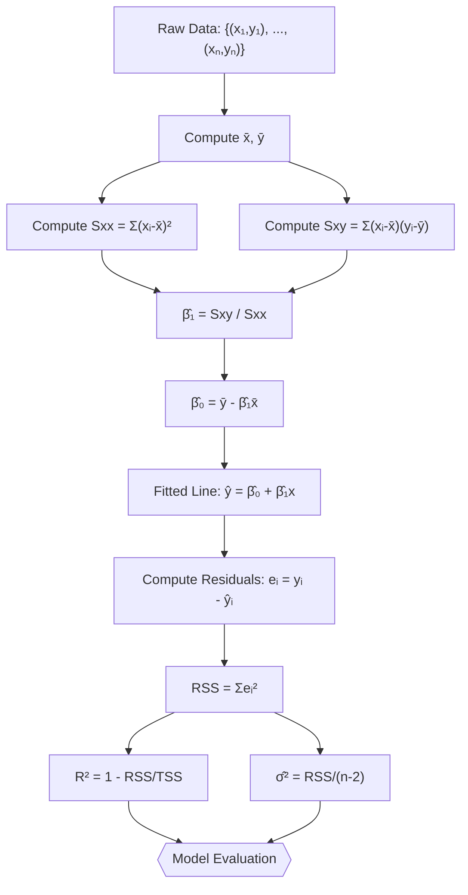
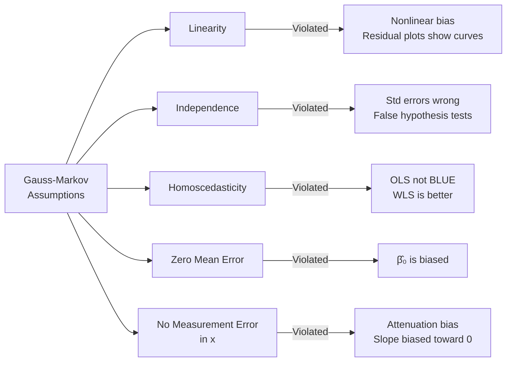
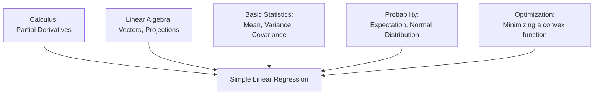
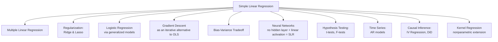

# Simple Linear Regression — Complete Notes

---

## 1. One-Line Summary

Simple Linear Regression finds the unique straight line through a cloud of points that minimizes the total squared vertical distance from every point to the line, giving us the best possible linear predictor of one variable from another.

---

## 2. The Intuition (Before Any Math)

### The 15-Year-Old Analogy

Imagine you're running a lemonade stand and you notice that on hotter days, you sell more cups. You've been keeping a notebook: "32°C → 80 cups sold, 25°C → 55 cups, 38°C → 110 cups..." and so on for 30 days.

Now your friend asks: "Hey, it's going to be 35°C tomorrow — how many cups should I expect?" You want to draw a single straight line through all your data points that best captures the trend, and then just read off the answer at 35°C.

But here's the key question: **of all the infinitely many straight lines you could draw, which one is the "best"?** You need a precise rule for what "best" means. Simple linear regression gives you exactly that rule — and it also hands you the unique, optimal straight line that satisfies it.

### What Problem Does This Solve?

We have two related numerical variables. One is something we can measure or control (like temperature), and the other is something we want to predict (like cups sold). We want:

1. A **quantitative estimate** of the relationship: "For every extra degree, I sell about 3.5 more cups."
2. A **prediction tool**: Given a new temperature, produce a best-guess for sales.
3. A way to **measure how strong** the relationship is.

Without regression, you're just eyeballing — regression makes this rigorous and optimal.

### Why It Matters in ML/AI Specifically

Simple linear regression is not just a tool — it is the **conceptual DNA** of almost all of modern machine learning:

- **The loss function idea** (minimize a measure of prediction error) comes directly from here.
- **Gradient descent**, the engine of deep learning, was partly motivated by the question "how do we minimize this regression loss when no closed form exists?"
- **The bias-variance tradeoff** is easiest to understand first in the regression context.
- **Regularization** (Ridge, Lasso) are direct extensions of linear regression.
- **Neural networks with no hidden layers and a linear activation are literally linear regression.**
- The **normal equations** introduce the idea of setting derivatives to zero to find optima — something you'll do constantly in ML theory.

If you truly understand simple linear regression — every formula, every assumption, every derivation — you understand the skeleton of machine learning.

---

## 3. Formal Definition

### The Setup

We have $n$ observations. Each observation $i$ consists of:
- $x_i \in \mathbb{R}$: the **input** (also called the predictor, feature, independent variable, or covariate). This is the thing we observe and use to predict.
- $y_i \in \mathbb{R}$: the **output** (also called the response, target, or dependent variable). This is the thing we want to predict.

Our dataset is: $\{(x_1, y_1), (x_2, y_2), \ldots, (x_n, y_n)\}$

### The Model

We **assume** that $y$ is a linear function of $x$, plus some noise:

$$y_i = \beta_0 + \beta_1 x_i + \varepsilon_i \quad \text{for } i = 1, 2, \ldots, n \tag{1}$$

Every symbol, defined right now:

- $\beta_0 \in \mathbb{R}$: the **intercept** (also called the bias). This is the value of $y$ when $x = 0$. It shifts the entire line up or down.
- $\beta_1 \in \mathbb{R}$: the **slope** (also called the coefficient or weight). This says: "for every 1-unit increase in $x$, $y$ changes by $\beta_1$ units."
- $\varepsilon_i \in \mathbb{R}$: the **error term** (also called noise or residual). This captures everything that affects $y_i$ but isn't captured by $x_i$. We assume $\varepsilon_i \sim \mathcal{N}(0, \sigma^2)$ — that is, the errors are independently drawn from a Normal distribution with mean zero and variance $\sigma^2$.

The **classical assumptions** (called Gauss-Markov assumptions) are:
1. **Linearity**: The true relationship between $x$ and $y$ is indeed linear.
2. **Independence**: Each $\varepsilon_i$ is independent of every other $\varepsilon_j$ for $i \neq j$.
3. **Homoscedasticity**: All errors have the same variance: $\text{Var}(\varepsilon_i) = \sigma^2$ (constant, does not depend on $i$ or $x_i$).
4. **Zero mean**: $\mathbb{E}[\varepsilon_i] = 0$ — errors are centered at zero (the line is the right center).
5. **No measurement error in $x$**: We observe $x_i$ perfectly.

### What We Want to Find

We want to **estimate** $\beta_0$ and $\beta_1$ from our data. We call our estimates $\hat{\beta}_0$ and $\hat{\beta}_1$ (hat = estimated from data). The **fitted line** is then:

$$\hat{y}_i = \hat{\beta}_0 + \hat{\beta}_1 x_i \tag{2}$$

where $\hat{y}_i$ is our **predicted value** for observation $i$.

### The Residual

The **residual** for observation $i$ is:

$$e_i = y_i - \hat{y}_i = y_i - \hat{\beta}_0 - \hat{\beta}_1 x_i \tag{3}$$

The residual is what's left over — the part of $y_i$ our line didn't explain. This is different from $\varepsilon_i$: the error $\varepsilon_i$ is the true (unobservable) noise in the data-generating process; the residual $e_i$ is the observable discrepancy after we've fit our estimated line.

### Plain English Summary

We're saying: "$y$ is approximately a straight-line function of $x$, with some random noise added." Our job is to find the specific straight line (the specific values of $\beta_0$ and $\beta_1$) that best fits our observed data. "Best" will be defined precisely in the next section.

---

## 4. Full Math Derivation

### 4.1 Defining "Best": The Ordinary Least Squares Criterion

We need a precise definition of what makes one line better than another. The standard choice is **Ordinary Least Squares (OLS)**: find $\hat{\beta}_0$ and $\hat{\beta}_1$ that minimize the **Residual Sum of Squares (RSS)**:

$$\text{RSS}(\beta_0, \beta_1) = \sum_{i=1}^{n} (y_i - \beta_0 - \beta_1 x_i)^2 \tag{4}$$

*Why squared errors?* Three reasons: (1) Squaring makes all errors positive, so positive and negative errors don't cancel. (2) Squaring penalizes large errors more than small ones — a single massive miss is worse than several small misses. (3) The square function is smooth and differentiable everywhere, making calculus-based optimization clean.

*Why not absolute errors?* You could use $\sum |y_i - \beta_0 - \beta_1 x_i|$ (called LAD regression), but the absolute value is not differentiable at zero, making optimization harder. OLS has a beautiful closed-form solution.

### 4.2 Setting Up the Optimization

We have a function of two variables: $\text{RSS}(\beta_0, \beta_1)$. To minimize it, we take the **partial derivative** with respect to each parameter, set both to zero, and solve the resulting system of two equations. These two equations are called the **Normal Equations**.

Let's write out RSS explicitly:

$$\text{RSS} = \sum_{i=1}^{n} (y_i - \beta_0 - \beta_1 x_i)^2 \tag{5}$$

### 4.3 Taking the Partial Derivative with Respect to $\beta_0$

$$\frac{\partial \text{RSS}}{\partial \beta_0} = \sum_{i=1}^{n} 2(y_i - \beta_0 - \beta_1 x_i) \cdot (-1) \tag{6}$$

*Why $(-1)$?* By the chain rule: the derivative of $(y_i - \beta_0 - \beta_1 x_i)^2$ with respect to $\beta_0$ is $2(y_i - \beta_0 - \beta_1 x_i)$ times the derivative of the inner function $(y_i - \beta_0 - \beta_1 x_i)$ with respect to $\beta_0$, which is $-1$.

Setting this to zero:

$$\sum_{i=1}^{n} 2(y_i - \beta_0 - \beta_1 x_i) \cdot (-1) = 0$$

Dividing both sides by $-2$:

$$\sum_{i=1}^{n} (y_i - \beta_0 - \beta_1 x_i) = 0 \tag{7}$$

Expanding the sum (using the fact that the sum is linear):

$$\sum_{i=1}^{n} y_i - \sum_{i=1}^{n} \beta_0 - \sum_{i=1}^{n} \beta_1 x_i = 0$$

$$\sum_{i=1}^{n} y_i - n\beta_0 - \beta_1 \sum_{i=1}^{n} x_i = 0 \tag{8}$$

*Why $\sum_{i=1}^n \beta_0 = n\beta_0$?* Because $\beta_0$ is a constant — it's summed $n$ times.

Dividing equation (8) through by $n$:

$$\bar{y} - \beta_0 - \beta_1 \bar{x} = 0 \tag{9}$$

where $\bar{y} = \frac{1}{n}\sum_{i=1}^n y_i$ is the **sample mean of** $y$, and $\bar{x} = \frac{1}{n}\sum_{i=1}^n x_i$ is the **sample mean of** $x$.

This gives us the **first normal equation**:

$$\hat{\beta}_0 = \bar{y} - \hat{\beta}_1 \bar{x} \tag{10}$$

**Geometric insight from equation (10):** The fitted line always passes through the point $(\bar{x}, \bar{y})$ — the center of mass of the data. This is guaranteed by the OLS solution, regardless of the data. The line pivots around this central point.

### 4.4 Taking the Partial Derivative with Respect to $\beta_1$

$$\frac{\partial \text{RSS}}{\partial \beta_1} = \sum_{i=1}^{n} 2(y_i - \beta_0 - \beta_1 x_i) \cdot (-x_i) \tag{11}$$

*Why $(-x_i)$?* By the chain rule: derivative of $(y_i - \beta_0 - \beta_1 x_i)^2$ with respect to $\beta_1$ is $2(y_i - \beta_0 - \beta_1 x_i)$ times the derivative of the inner function with respect to $\beta_1$, which is $-x_i$.

Setting to zero and dividing by $-2$:

$$\sum_{i=1}^{n} x_i(y_i - \beta_0 - \beta_1 x_i) = 0 \tag{12}$$

Expanding:

$$\sum_{i=1}^{n} x_i y_i - \beta_0 \sum_{i=1}^{n} x_i - \beta_1 \sum_{i=1}^{n} x_i^2 = 0 \tag{13}$$

### 4.5 Solving the Normal Equations

From equation (10), we know $\hat{\beta}_0 = \bar{y} - \hat{\beta}_1 \bar{x}$. Substitute this into equation (13):

$$\sum_{i=1}^{n} x_i y_i - (\bar{y} - \hat{\beta}_1 \bar{x}) \sum_{i=1}^{n} x_i - \hat{\beta}_1 \sum_{i=1}^{n} x_i^2 = 0$$

Note that $\sum_{i=1}^n x_i = n\bar{x}$, so:

$$\sum_{i=1}^{n} x_i y_i - (\bar{y} - \hat{\beta}_1 \bar{x})(n\bar{x}) - \hat{\beta}_1 \sum_{i=1}^{n} x_i^2 = 0$$

$$\sum_{i=1}^{n} x_i y_i - n\bar{x}\bar{y} + \hat{\beta}_1 n\bar{x}^2 - \hat{\beta}_1 \sum_{i=1}^{n} x_i^2 = 0$$

Collecting $\hat{\beta}_1$ terms on the right:

$$\sum_{i=1}^{n} x_i y_i - n\bar{x}\bar{y} = \hat{\beta}_1 \left(\sum_{i=1}^{n} x_i^2 - n\bar{x}^2\right) \tag{14}$$

*Why is this valid?* Simple algebra — we just moved $\hat{\beta}_1$ terms to one side.

Solving for $\hat{\beta}_1$:

$$\hat{\beta}_1 = \frac{\sum_{i=1}^{n} x_i y_i - n\bar{x}\bar{y}}{\sum_{i=1}^{n} x_i^2 - n\bar{x}^2} \tag{15}$$

### 4.6 Simplifying the Formula for $\hat{\beta}_1$

The numerator and denominator of (15) have elegant simplifications. Let's work through them carefully.

**Simplifying the numerator:** We claim that:

$$\sum_{i=1}^{n} x_i y_i - n\bar{x}\bar{y} = \sum_{i=1}^{n} (x_i - \bar{x})(y_i - \bar{y}) \tag{16}$$

*Proof:* Expand the right side:

$$\sum_{i=1}^{n} (x_i - \bar{x})(y_i - \bar{y}) = \sum_{i=1}^{n} \left(x_i y_i - x_i \bar{y} - \bar{x} y_i + \bar{x}\bar{y}\right)$$

$$= \sum_{i=1}^{n} x_i y_i - \bar{y}\sum_{i=1}^{n} x_i - \bar{x}\sum_{i=1}^{n} y_i + n\bar{x}\bar{y}$$

Now, $\sum_{i=1}^n x_i = n\bar{x}$ and $\sum_{i=1}^n y_i = n\bar{y}$, so:

$$= \sum_{i=1}^{n} x_i y_i - \bar{y}(n\bar{x}) - \bar{x}(n\bar{y}) + n\bar{x}\bar{y}$$

$$= \sum_{i=1}^{n} x_i y_i - n\bar{x}\bar{y} - n\bar{x}\bar{y} + n\bar{x}\bar{y}$$

$$= \sum_{i=1}^{n} x_i y_i - n\bar{x}\bar{y} \quad \checkmark$$

This quantity $\sum_{i=1}^{n} (x_i - \bar{x})(y_i - \bar{y})$ is called the **sample covariance of $x$ and $y$** (unnormalized), written $S_{xy}$.

**Simplifying the denominator:** By the exact same algebra (just replace $y_i$ with $x_i$):

$$\sum_{i=1}^{n} x_i^2 - n\bar{x}^2 = \sum_{i=1}^{n} (x_i - \bar{x})^2 \tag{17}$$

This quantity is called the **sample variance of $x$** (unnormalized), written $S_{xx}$.

So the final, clean formula for the OLS slope estimator is:

$$\boxed{\hat{\beta}_1 = \frac{\sum_{i=1}^{n}(x_i - \bar{x})(y_i - \bar{y})}{\sum_{i=1}^{n}(x_i - \bar{x})^2} = \frac{S_{xy}}{S_{xx}}} \tag{18}$$

And the intercept:

$$\boxed{\hat{\beta}_0 = \bar{y} - \hat{\beta}_1 \bar{x}} \tag{19}$$

### 4.7 Connecting to Correlation

The **sample correlation coefficient** $r$ between $x$ and $y$ is:

$$r = \frac{\sum_{i=1}^{n}(x_i - \bar{x})(y_i - \bar{y})}{\sqrt{\sum_{i=1}^{n}(x_i - \bar{x})^2} \cdot \sqrt{\sum_{i=1}^{n}(y_i - \bar{y})^2}} = \frac{S_{xy}}{\sqrt{S_{xx} \cdot S_{yy}}} \tag{20}$$

where $S_{yy} = \sum_{i=1}^n (y_i - \bar{y})^2$ is the unnormalized sample variance of $y$.

We can re-express the slope as:

$$\hat{\beta}_1 = r \cdot \frac{s_y}{s_x} \tag{21}$$

where $s_x = \sqrt{\frac{S_{xx}}{n-1}}$ and $s_y = \sqrt{\frac{S_{yy}}{n-1}}$ are the **sample standard deviations** of $x$ and $y$ respectively.

*Why is this useful?* Equation (21) tells us the slope is the correlation scaled by the ratio of standard deviations. If we standardize both variables (mean 0, std 1), the slope equals the correlation. This is a profound connection.

### 4.8 Proving the Minimum (Not Just a Critical Point)

We took derivatives and found a critical point. How do we know it's a minimum and not a maximum or saddle point? We use the **second-order conditions**.

The Hessian matrix of RSS with respect to $(\beta_0, \beta_1)$ is:

$$H = \begin{pmatrix} \frac{\partial^2 \text{RSS}}{\partial \beta_0^2} & \frac{\partial^2 \text{RSS}}{\partial \beta_0 \partial \beta_1} \\ \frac{\partial^2 \text{RSS}}{\partial \beta_1 \partial \beta_0} & \frac{\partial^2 \text{RSS}}{\partial \beta_1^2} \end{pmatrix}$$

Computing each entry from equation (5):

$$\frac{\partial^2 \text{RSS}}{\partial \beta_0^2} = 2n \tag{22}$$

$$\frac{\partial^2 \text{RSS}}{\partial \beta_1^2} = 2\sum_{i=1}^{n} x_i^2 \tag{23}$$

$$\frac{\partial^2 \text{RSS}}{\partial \beta_0 \partial \beta_1} = 2\sum_{i=1}^{n} x_i \tag{24}$$

So:

$$H = 2\begin{pmatrix} n & \sum x_i \\ \sum x_i & \sum x_i^2 \end{pmatrix}$$

For a minimum, we need $H$ to be **positive definite** (all eigenvalues positive). The sufficient condition: (1) top-left entry is positive: $2n > 0$ ✓ (always true for $n \geq 1$), and (2) the determinant is positive:

$$\det(H) = 4\left(n \sum x_i^2 - \left(\sum x_i\right)^2\right) = 4n^2\left(\frac{1}{n}\sum x_i^2 - \bar{x}^2\right) = 4n^2 \cdot \text{Var}(x)$$

This is positive as long as **not all $x_i$ are identical** (i.e., there is some variation in $x$). If all $x_i$ are the same, you literally cannot fit a line — the denominator of $\hat{\beta}_1$ is zero.

Conclusion: The critical point we found is a strict global minimum, and RSS is a **convex function** (in fact, strictly convex when $x$ has variance), so it has exactly one minimum.

### 4.9 Measuring Fit: The Coefficient of Determination $R^2$

How good is our fitted line? We decompose the total variation in $y$ into explained and unexplained parts.

Define:

- **Total Sum of Squares (TSS)**: $\text{TSS} = \sum_{i=1}^n (y_i - \bar{y})^2$ — total variation in $y$.
- **Residual Sum of Squares (RSS)**: $\text{RSS} = \sum_{i=1}^n (y_i - \hat{y}_i)^2$ — variation not explained by the model.
- **Explained Sum of Squares (ESS)**: $\text{ESS} = \sum_{i=1}^n (\hat{y}_i - \bar{y})^2$ — variation explained by the model.

**Theorem:** $\text{TSS} = \text{ESS} + \text{RSS}$

*Proof:*

$$\sum_{i=1}^n (y_i - \bar{y})^2 = \sum_{i=1}^n \left[(y_i - \hat{y}_i) + (\hat{y}_i - \bar{y})\right]^2$$

$$= \sum_{i=1}^n (y_i - \hat{y}_i)^2 + 2\sum_{i=1}^n (y_i - \hat{y}_i)(\hat{y}_i - \bar{y}) + \sum_{i=1}^n (\hat{y}_i - \bar{y})^2$$

The cross-term $\sum_{i=1}^n (y_i - \hat{y}_i)(\hat{y}_i - \bar{y}) = \sum_{i=1}^n e_i(\hat{y}_i - \bar{y})$ is zero. *Why?* The OLS residuals $e_i$ are orthogonal to fitted values $\hat{y}_i$ (and to any linear combination of the $x_i$s including $\bar{y}$). This orthogonality follows directly from the normal equations — see it as the geometric consequence of projecting $y$ onto the column space of $X$.

Therefore: $\text{TSS} = \text{RSS} + \text{ESS}$ ✓

The **coefficient of determination** $R^2$ is:

$$\boxed{R^2 = \frac{\text{ESS}}{\text{TSS}} = 1 - \frac{\text{RSS}}{\text{TSS}}} \tag{25}$$

$R^2 \in [0, 1]$ (for simple linear regression — it can be negative for multiple regression if you fit without an intercept). It tells you the **fraction of variance in $y$ explained by the linear relationship with $x$**.

**Key fact:** In simple linear regression (with an intercept), $R^2 = r^2$, the square of the correlation coefficient. This is a non-trivial result — the model's explanatory power exactly equals the squared correlation.

*Proof:*
$$R^2 = \frac{\text{ESS}}{\text{TSS}} = \frac{\hat{\beta}_1^2 S_{xx}}{S_{yy}} = \frac{\left(\frac{S_{xy}}{S_{xx}}\right)^2 S_{xx}}{S_{yy}} = \frac{S_{xy}^2}{S_{xx} \cdot S_{yy}} = r^2 \tag{26}$$

### 4.10 Estimating the Error Variance $\sigma^2$

We assumed $\varepsilon_i \sim \mathcal{N}(0, \sigma^2)$, but $\sigma^2$ is unknown. We estimate it from the residuals:

$$\hat{\sigma}^2 = \frac{\text{RSS}}{n - 2} = \frac{\sum_{i=1}^{n} e_i^2}{n-2} \tag{27}$$

*Why divide by $n-2$ and not $n$?* We lose **2 degrees of freedom** because we estimated 2 parameters ($\beta_0$ and $\beta_1$) from the data. The residuals are constrained to satisfy two conditions (from the two normal equations): $\sum e_i = 0$ and $\sum x_i e_i = 0$. So only $n-2$ of the $n$ residuals are "free." Dividing by $n-2$ makes $\hat{\sigma}^2$ an **unbiased estimator** of $\sigma^2$, meaning $\mathbb{E}[\hat{\sigma}^2] = \sigma^2$.

### 4.11 Properties of the OLS Estimators

Under the Gauss-Markov assumptions:

**Unbiasedness:**
$$\mathbb{E}[\hat{\beta}_1] = \beta_1, \quad \mathbb{E}[\hat{\beta}_0] = \beta_0 \tag{28}$$

*Proof for $\hat{\beta}_1$:*

$$\hat{\beta}_1 = \frac{\sum(x_i - \bar{x})(y_i - \bar{y})}{\sum(x_i - \bar{x})^2} = \frac{\sum(x_i - \bar{x})y_i}{\sum(x_i - \bar{x})^2}$$

(The $\bar{y}$ version: $\sum(x_i-\bar{x})\bar{y} = \bar{y}\sum(x_i-\bar{x}) = \bar{y} \cdot 0 = 0$, so we can drop it.)

Let $w_i = \frac{x_i - \bar{x}}{S_{xx}}$ where $S_{xx} = \sum(x_i-\bar{x})^2$. Then $\hat{\beta}_1 = \sum w_i y_i$, a linear combination of the $y_i$s.

$$\mathbb{E}[\hat{\beta}_1] = \sum w_i \mathbb{E}[y_i] = \sum w_i (\beta_0 + \beta_1 x_i)$$

$$= \beta_0 \sum w_i + \beta_1 \sum w_i x_i$$

Now: $\sum w_i = \frac{\sum(x_i - \bar{x})}{S_{xx}} = \frac{0}{S_{xx}} = 0$ and $\sum w_i x_i = \frac{\sum(x_i-\bar{x})x_i}{S_{xx}} = \frac{S_{xx}}{S_{xx}} = 1$.

Therefore $\mathbb{E}[\hat{\beta}_1] = \beta_0 \cdot 0 + \beta_1 \cdot 1 = \beta_1$ ✓

**Variance:**
$$\text{Var}(\hat{\beta}_1) = \frac{\sigma^2}{S_{xx}} = \frac{\sigma^2}{\sum(x_i - \bar{x})^2} \tag{29}$$

$$\text{Var}(\hat{\beta}_0) = \sigma^2 \left(\frac{1}{n} + \frac{\bar{x}^2}{S_{xx}}\right) \tag{30}$$

*Proof of (29):* Since $\hat{\beta}_1 = \sum w_i y_i$ with $y_i$ independent:

$$\text{Var}(\hat{\beta}_1) = \sum w_i^2 \text{Var}(y_i) = \sigma^2 \sum w_i^2 = \sigma^2 \frac{\sum(x_i-\bar{x})^2}{S_{xx}^2} = \frac{\sigma^2}{S_{xx}}$$

**Gauss-Markov Theorem:** Among all **linear unbiased estimators** of $\beta_1$, the OLS estimator $\hat{\beta}_1$ has the **smallest variance**. In other words, OLS is **BLUE** — Best Linear Unbiased Estimator. This is a powerful optimality result — you can't do better (in terms of variance) if you want a linear, unbiased estimator.

---

## 5. Deep Intuition Behind the Math

### Why Does the Formula for $\hat{\beta}_1$ Look Like This?

Look at the slope formula again:

$$\hat{\beta}_1 = \frac{\sum(x_i - \bar{x})(y_i - \bar{y})}{\sum(x_i - \bar{x})^2}$$

The **numerator** measures: "When $x$ is above its average, is $y$ also above its average? And when $x$ is below average, is $y$ below average?" That's covariance — how $x$ and $y$ move together relative to their centers.

The **denominator** measures: "How spread out is $x$?" It normalizes by the variation in $x$.

Together: the slope is "how much $y$ co-varies with $x$, per unit of $x$'s own variance." This is exactly what "slope" should mean — it's measuring the "bang per buck" of moving $x$.

### What Happens If We Change Key Assumptions?

**If errors are not zero-mean ($\mathbb{E}[\varepsilon_i] \neq 0$):** The estimator $\hat{\beta}_0$ will be biased. The intercept absorbs the mean error, but if that mean isn't zero, you're systematically over- or under-predicting.

**If errors are heteroscedastic (varying variance):** OLS is still unbiased, but it's no longer BLUE. Weighted Least Squares (WLS), which gives less weight to high-variance observations, becomes more efficient. OLS ignores the reliability of each observation.

**If $x$ and $\varepsilon$ are correlated (endogeneity):** This is the most serious violation. $\hat{\beta}_1$ becomes **biased AND inconsistent** — even with infinite data, you won't converge to the truth. This happens when there are omitted variables that affect both $x$ and $y$ (called omitted variable bias). The solution is Instrumental Variables (IV) regression.

**If the true relationship is nonlinear:** The OLS line gives the best linear approximation, but it's still just an approximation. The residuals will show systematic patterns (curved residual plots), and predictions will be systematically wrong in certain regions.

**If errors are not independent:** The variance formulas (29) and (30) are wrong. Standard errors are underestimated, hypothesis tests give false positives. Time-series data is especially prone to this (autocorrelated errors).

### Common Misconceptions

**Misconception 1: "High $R^2$ means the model is good."**
Wrong. $R^2$ measures explanatory power, not predictive accuracy, causal validity, or model correctness. You can get $R^2 = 0.99$ by fitting noise, or with a model that violates all assumptions. Always check residual plots.

**Misconception 2: "Correlation means causation, so $\hat{\beta}_1$ tells us the causal effect."**
Wrong. OLS gives the best linear predictor, not the causal effect. If $x$ and $y$ are both caused by a third variable $z$ (a "confounder"), you'll find a non-zero $\hat{\beta}_1$ even if $x$ has zero causal effect on $y$. Causality requires additional assumptions (randomized experiments, or careful causal modeling).

**Misconception 3: "The line goes through the data."**
The line goes through $(\bar{x}, \bar{y})$, not through every data point. The whole point is that the data is noisy, and the line is a smooth summary.

**Misconception 4: "Large sample size cures all assumption violations."**
Large $n$ fixes problems of estimation uncertainty (variances shrink), but it cannot fix bias from violated assumptions. A biased estimator stays biased as $n \to \infty$; it just converges more precisely to the wrong answer.

**Misconception 5: "OLS minimizes horizontal distances."**
OLS minimizes *vertical* distances (residuals in the $y$ direction). This makes sense because we're predicting $y$ from $x$: $x$ is fixed/known, $y$ is what we're uncertain about. If you want to minimize perpendicular distances, that's called **Total Least Squares (Orthogonal Regression)**.

---

## 6. Visual Explanation

### 6.1 The OLS Setup — What We're Minimizing

```
y
│                              ●  (y_i)
│                          ↕  |  ← residual e_i = y_i - ŷ_i
│                              ○  (ŷ_i on the line)
│                    ●
│               ○ ↗
│          ● ↗
│     ● ↗
│  ↗●
│╱ ← fitted line: ŷ = β̂₀ + β̂₁x
└──────────────────────────────── x
```

Each vertical arrow is a residual. OLS minimizes the sum of squared lengths of these arrows.

### 6.2 Geometric View — Projection

Think of the $n$ observations as two vectors in $\mathbb{R}^n$:
- $\mathbf{y} = (y_1, y_2, \ldots, y_n)^T$ — the response vector
- Column space of $X$ (spanned by $\mathbf{1}$ and $\mathbf{x}$) — a 2D plane in $\mathbb{R}^n$

OLS finds $\hat{\mathbf{y}}$ as the **orthogonal projection** of $\mathbf{y}$ onto this plane. The residual vector $\mathbf{e} = \mathbf{y} - \hat{\mathbf{y}}$ is perpendicular to the column space — this is why $\sum e_i = 0$ and $\sum x_i e_i = 0$.

```
ℝⁿ space:
         y  (actual response vector)
        /|
       / |  ← e = y - ŷ (residual vector, perpendicular to plane)
      /  |
     /   |
    /    ↓
   ŷ ←── projection of y onto column space of X
   (on the plane spanned by 1 and x)
   
   The plane represents all possible linear combinations: β₀·1 + β₁·x
```

### 6.3 RSS Surface — A Bowl

The RSS as a function of $(\beta_0, \beta_1)$ is a **paraboloid** — a smooth bowl shape opening upward:

```
RSS
│   ╲         ╱
│    ╲       ╱
│     ╲     ╱
│      ╲   ╱
│       ╲ ╱
│        ★  ← unique minimum at (β̂₀, β̂₁)
│
└────────────── β₀, β₁ plane
```

Convexity guarantees a unique global minimum. No local minima to get stuck in — this is why OLS has a closed-form solution while neural networks don't.

### 6.4 The TSS = ESS + RSS Decomposition

```
y
│    ●
│    |← (y_i - ȳ) = total deviation
│    |
│    ○ ← ŷ_i = predicted, so (ŷ_i - ȳ) is "explained"
│    |← (y_i - ŷ_i) = residual, "unexplained"
│    |
ȳ ───────────────── x
```

Every individual point's deviation from $\bar{y}$ splits into two parts: the part the line explains (how far the predicted value is from $\bar{y}$) and the part the line doesn't explain (the residual).

### 6.5 Mermaid: The Full Pipeline



### 6.6 Mermaid: Assumptions and What Breaks When Violated



---

## 7. Code From Scratch (NumPy Only)

```python
import numpy as np

# ============================================================
# SIMPLE LINEAR REGRESSION — FROM SCRATCH
# Every line commented with WHY, not just what.
# Variable names match the math notation in this document.
# ============================================================

np.random.seed(42)  # Fix random seed so results are reproducible

# ---- STEP 0: Generate synthetic data ----
# True parameters (β₀ and β₁) that we'll try to recover
beta_0_true = 3.0   # True intercept
beta_1_true = 2.5   # True slope
sigma_true = 2.0    # True error std deviation

n = 100  # Number of observations

# x values: the "inputs" or "features"
x = np.linspace(0, 10, n)  # 100 evenly spaced points from 0 to 10

# Generate errors: εᵢ ~ N(0, σ²)
# This is the noise that makes real data imperfect
epsilon = np.random.normal(loc=0, scale=sigma_true, size=n)

# Generate y according to the true linear model: yᵢ = β₀ + β₁xᵢ + εᵢ
y = beta_0_true + beta_1_true * x + epsilon

print("=" * 60)
print("DATA SUMMARY")
print("=" * 60)
print(f"Number of observations: n = {n}")
print(f"True β₀ = {beta_0_true}, True β₁ = {beta_1_true}")
print(f"First 5 observations (x, y):")
for i in range(5):
    print(f"  x_{i+1} = {x[i]:.3f}, y_{i+1} = {y[i]:.3f}")


# ---- STEP 1: Compute sample means ----
# x̄ = (1/n) Σ xᵢ  — the "center" of x values
# ȳ = (1/n) Σ yᵢ  — the "center" of y values
x_bar = np.mean(x)  # = (1/n) * Σxᵢ
y_bar = np.mean(y)  # = (1/n) * Σyᵢ

print("\n" + "=" * 60)
print("STEP 1: Sample Means")
print("=" * 60)
print(f"x̄ = {x_bar:.4f}")
print(f"ȳ = {y_bar:.4f}")


# ---- STEP 2: Compute deviations from mean ----
# (xᵢ - x̄): how far each xᵢ is from the center of x
# (yᵢ - ȳ): how far each yᵢ is from the center of y
# These are the building blocks of covariance and variance
x_dev = x - x_bar  # shape (n,) — array of (xᵢ - x̄) for all i
y_dev = y - y_bar  # shape (n,) — array of (yᵢ - ȳ) for all i

print("\n" + "=" * 60)
print("STEP 2: Deviations from Mean (first 5)")
print("=" * 60)
for i in range(5):
    print(f"  x_{i+1} - x̄ = {x_dev[i]:.4f}, y_{i+1} - ȳ = {y_dev[i]:.4f}")


# ---- STEP 3: Compute S_xx and S_xy ----
# S_xx = Σ(xᵢ - x̄)² — unnormalized sample variance of x
# This is the denominator of β̂₁.
# Measures how spread out the x values are.
S_xx = np.sum(x_dev ** 2)

# S_xy = Σ(xᵢ - x̄)(yᵢ - ȳ) — unnormalized sample covariance
# This is the numerator of β̂₁.
# Measures how x and y co-vary around their respective means.
S_xy = np.sum(x_dev * y_dev)

# S_yy = Σ(yᵢ - ȳ)² — unnormalized sample variance of y
# Needed for R² and correlation coefficient.
S_yy = np.sum(y_dev ** 2)

print("\n" + "=" * 60)
print("STEP 3: Key Sums")
print("=" * 60)
print(f"S_xx = Σ(xᵢ - x̄)² = {S_xx:.4f}")
print(f"S_xy = Σ(xᵢ - x̄)(yᵢ - ȳ) = {S_xy:.4f}")
print(f"S_yy = Σ(yᵢ - ȳ)² = {S_yy:.4f}")


# ---- STEP 4: Compute OLS estimates ----
# β̂₁ = S_xy / S_xx  (equation 18 in our derivation)
# This is the slope: for every 1-unit increase in x, y increases by β̂₁
beta_1_hat = S_xy / S_xx

# β̂₀ = ȳ - β̂₁ * x̄  (equation 19 in our derivation)
# This ensures the line passes through the point (x̄, ȳ)
beta_0_hat = y_bar - beta_1_hat * x_bar

print("\n" + "=" * 60)
print("STEP 4: OLS Coefficient Estimates")
print("=" * 60)
print(f"β̂₁ = S_xy / S_xx = {S_xy:.4f} / {S_xx:.4f} = {beta_1_hat:.6f}")
print(f"  True β₁ = {beta_1_true} — difference = {abs(beta_1_hat - beta_1_true):.6f}")
print(f"β̂₀ = ȳ - β̂₁·x̄ = {y_bar:.4f} - {beta_1_hat:.4f}·{x_bar:.4f} = {beta_0_hat:.6f}")
print(f"  True β₀ = {beta_0_true} — difference = {abs(beta_0_hat - beta_0_true):.6f}")


# ---- STEP 5: Compute fitted values ----
# ŷᵢ = β̂₀ + β̂₁·xᵢ — the model's prediction for each observation
# This is what the LINE says y should be at each x value
y_hat = beta_0_hat + beta_1_hat * x  # shape (n,)

print("\n" + "=" * 60)
print("STEP 5: Fitted Values (first 5)")
print("=" * 60)
for i in range(5):
    print(f"  ŷ_{i+1} = {beta_0_hat:.4f} + {beta_1_hat:.4f} × {x[i]:.4f} = {y_hat[i]:.4f}")
    print(f"         (actual y_{i+1} = {y[i]:.4f})")


# ---- STEP 6: Compute residuals ----
# eᵢ = yᵢ - ŷᵢ — the unexplained part of each observation
# These should: (1) sum to zero, (2) be uncorrelated with x
e = y - y_hat  # shape (n,)

print("\n" + "=" * 60)
print("STEP 6: Residuals")
print("=" * 60)
print(f"Sum of residuals Σeᵢ = {np.sum(e):.10f}  (should be ≈ 0)")
print(f"Sum of x·residuals Σxᵢeᵢ = {np.sum(x * e):.10f}  (should be ≈ 0)")
# Both being ~0 confirms the normal equations were satisfied


# ---- STEP 7: Compute RSS, TSS, ESS, and R² ----
# RSS (Residual Sum of Squares): variation the line did NOT explain
RSS = np.sum(e ** 2)

# TSS (Total Sum of Squares): total variation in y around its mean
TSS = S_yy  # = Σ(yᵢ - ȳ)² — we already computed this above

# ESS (Explained Sum of Squares): variation the line DID explain
ESS = np.sum((y_hat - y_bar) ** 2)

# Verify the decomposition: TSS = ESS + RSS
print("\n" + "=" * 60)
print("STEP 7: Variance Decomposition")
print("=" * 60)
print(f"RSS = Σeᵢ² = {RSS:.4f}")
print(f"TSS = Σ(yᵢ - ȳ)² = {TSS:.4f}")
print(f"ESS = Σ(ŷᵢ - ȳ)² = {ESS:.4f}")
print(f"ESS + RSS = {ESS + RSS:.4f}  (should equal TSS = {TSS:.4f})")

# R² = 1 - RSS/TSS — fraction of variance explained by the model
R_squared = 1 - RSS / TSS
print(f"\nR² = 1 - RSS/TSS = 1 - {RSS:.4f}/{TSS:.4f} = {R_squared:.6f}")


# ---- STEP 8: Compute correlation and verify R² = r² ----
# r = S_xy / sqrt(S_xx * S_yy) — sample correlation coefficient
r = S_xy / np.sqrt(S_xx * S_yy)

print("\n" + "=" * 60)
print("STEP 8: Correlation Coefficient")
print("=" * 60)
print(f"r = S_xy / √(S_xx · S_yy) = {r:.6f}")
print(f"r² = {r**2:.6f}")
print(f"R² = {R_squared:.6f}  (should equal r² = {r**2:.6f})")


# ---- STEP 9: Estimate error variance σ² ----
# σ̂² = RSS / (n - 2) — we divide by n-2 (not n) because we estimated 2 parameters
# This makes σ̂² an unbiased estimator of the true σ²
sigma_sq_hat = RSS / (n - 2)  # Unbiased estimate of σ²
sigma_hat = np.sqrt(sigma_sq_hat)  # Standard error of the regression

print("\n" + "=" * 60)
print("STEP 9: Error Variance Estimate")
print("=" * 60)
print(f"σ̂² = RSS/(n-2) = {RSS:.4f}/{n-2} = {sigma_sq_hat:.6f}")
print(f"σ̂ = {sigma_hat:.6f}  (true σ = {sigma_true})")


# ---- STEP 10: Compute standard errors of estimates ----
# SE(β̂₁) = σ̂ / sqrt(S_xx) — uncertainty in slope estimate
# SE(β̂₀) = σ̂ · sqrt(1/n + x̄²/S_xx) — uncertainty in intercept estimate
SE_beta_1 = np.sqrt(sigma_sq_hat / S_xx)   # Standard error of β̂₁
SE_beta_0 = np.sqrt(sigma_sq_hat * (1/n + x_bar**2 / S_xx))  # SE of β̂₀

print("\n" + "=" * 60)
print("STEP 10: Standard Errors of Coefficient Estimates")
print("=" * 60)
print(f"SE(β̂₁) = σ̂/√S_xx = {SE_beta_1:.6f}")
print(f"SE(β̂₀) = σ̂·√(1/n + x̄²/S_xx) = {SE_beta_0:.6f}")

# t-statistics: how many standard errors away from zero is our estimate?
# Under H₀: βⱼ = 0, these follow a t-distribution with n-2 degrees of freedom
t_beta_1 = beta_1_hat / SE_beta_1  # t-stat for slope
t_beta_0 = beta_0_hat / SE_beta_0  # t-stat for intercept

print(f"\nt-statistic for β̂₁: {t_beta_1:.4f}  (very large → slope is significantly nonzero)")
print(f"t-statistic for β̂₀: {t_beta_0:.4f}")


# ---- STEP 11: Make a prediction ----
# Given a new x value, our best prediction of y
x_new = 7.5  # A new x value we want to predict at
y_pred = beta_0_hat + beta_1_hat * x_new  # The line gives us this directly

# 95% prediction interval — where we expect a NEW observation to fall
# PI = ŷ ± t_{n-2, 0.025} · σ̂ · √(1 + 1/n + (x_new - x̄)²/S_xx)
# The "+1" under the square root accounts for the new observation's own noise
from scipy import stats as scipy_stats  # Only using this for the t critical value
t_crit = scipy_stats.t.ppf(0.975, df=n-2)  # ~1.984 for n=100

# Margin of error: includes uncertainty from both estimation AND new observation's noise
PI_margin = t_crit * sigma_hat * np.sqrt(1 + 1/n + (x_new - x_bar)**2 / S_xx)

print("\n" + "=" * 60)
print("STEP 11: Prediction")
print("=" * 60)
print(f"New x = {x_new}")
print(f"Predicted ŷ = {beta_0_hat:.4f} + {beta_1_hat:.4f} × {x_new} = {y_pred:.4f}")
print(f"True expected y = {beta_0_true + beta_1_true * x_new:.4f}")
print(f"95% Prediction Interval: ({y_pred - PI_margin:.4f}, {y_pred + PI_margin:.4f})")


# ---- FINAL SUMMARY ----
print("\n" + "=" * 60)
print("FINAL MODEL SUMMARY")
print("=" * 60)
print(f"Fitted model: ŷ = {beta_0_hat:.4f} + {beta_1_hat:.4f}·x")
print(f"True model:   y  = {beta_0_true}    + {beta_1_true}·x + ε")
print(f"R² = {R_squared:.4f}  ({R_squared*100:.2f}% of variance explained)")
print(f"σ̂ = {sigma_hat:.4f}  (estimated noise level, true = {sigma_true})")
print(f"n = {n} observations")
```

**Expected Output Highlights:**
```
β̂₁ ≈ 2.5xxx   (close to true β₁ = 2.5)
β̂₀ ≈ 3.0xxx   (close to true β₀ = 3.0)
Sum of residuals Σeᵢ = 0.0000000000  (exactly 0 up to floating point)
R² = r²  (confirmed numerically)
σ̂ ≈ 2.0  (close to true σ = 2.0)
```

---

## 8. Interview Preparation Section

### 5 Conceptual Questions with Ideal Answers

---

**Q1: Derive the OLS estimator for the slope $\hat{\beta}_1$ from scratch.**

**Ideal Answer:**

Start from the loss function we want to minimize — the Residual Sum of Squares:

$$\text{RSS}(\beta_0, \beta_1) = \sum_{i=1}^{n} (y_i - \beta_0 - \beta_1 x_i)^2$$

Take the partial derivative with respect to $\beta_0$ and set to zero:

$$\frac{\partial \text{RSS}}{\partial \beta_0} = -2\sum_{i=1}^n (y_i - \beta_0 - \beta_1 x_i) = 0 \implies \hat{\beta}_0 = \bar{y} - \hat{\beta}_1 \bar{x}$$

Take the partial derivative with respect to $\beta_1$ and set to zero:

$$\frac{\partial \text{RSS}}{\partial \beta_1} = -2\sum_{i=1}^n x_i(y_i - \beta_0 - \beta_1 x_i) = 0$$

Substitute the expression for $\hat{\beta}_0$:

$$\sum x_i y_i - n\bar{x}\bar{y} = \hat{\beta}_1(\sum x_i^2 - n\bar{x}^2)$$

$$\hat{\beta}_1 = \frac{\sum(x_i - \bar{x})(y_i - \bar{y})}{\sum(x_i - \bar{x})^2} = \frac{S_{xy}}{S_{xx}}$$

This is a minimum because the Hessian is positive definite (RSS is strictly convex when $x$ has nonzero variance).

---

**Q2: What are the Gauss-Markov assumptions, and what does the Gauss-Markov theorem tell us?**

**Ideal Answer:**

The Gauss-Markov assumptions are: (1) the model is correctly specified as linear; (2) the error terms have zero conditional mean, $\mathbb{E}[\varepsilon_i | x_i] = 0$; (3) errors are homoscedastic, $\text{Var}(\varepsilon_i) = \sigma^2$; (4) errors are uncorrelated, $\text{Cov}(\varepsilon_i, \varepsilon_j) = 0$ for $i \neq j$.

Under these assumptions, the Gauss-Markov Theorem states that the OLS estimator is **BLUE** — the Best Linear Unbiased Estimator. "Best" means minimum variance; "linear" means it's a linear function of the $y_i$s; "unbiased" means $\mathbb{E}[\hat{\beta}_j] = \beta_j$.

Critically, Gauss-Markov does **not** require Normality of errors. You don't need the Normal distribution assumption for the point estimates to be optimal — you only need Normality for inference (confidence intervals, hypothesis tests) using the t- and F-distributions.

---

**Q3: What is $R^2$, and why is it equal to $r^2$ in simple linear regression?**

**Ideal Answer:**

$R^2 = 1 - \text{RSS}/\text{TSS}$ measures the fraction of total variance in $y$ explained by the linear model. It ranges from 0 (the model does no better than predicting $\bar{y}$ for everyone) to 1 (perfect fit, no residuals).

In simple linear regression:

$$R^2 = \frac{\text{ESS}}{\text{TSS}} = \frac{\hat{\beta}_1^2 S_{xx}}{S_{yy}} = \frac{\left(\frac{S_{xy}}{S_{xx}}\right)^2 S_{xx}}{S_{yy}} = \frac{S_{xy}^2}{S_{xx} \cdot S_{yy}} = r^2$$

where $r = S_{xy}/\sqrt{S_{xx} S_{yy}}$ is the sample correlation. So $R^2$ is literally the squared correlation between $x$ and $y$. This is unique to the simple (one-predictor) case. In multiple regression, $R^2$ is the squared correlation between $y$ and $\hat{y}$, not between $y$ and any single predictor.

---

**Q4: Explain the bias-variance tradeoff in the context of OLS regression.**

**Ideal Answer:**

The OLS estimator $\hat{\beta}_1$ is unbiased: $\mathbb{E}[\hat{\beta}_1] = \beta_1$. Its variance is $\text{Var}(\hat{\beta}_1) = \sigma^2/S_{xx}$.

The bias-variance tradeoff becomes relevant when we consider alternatives to OLS:

- **Ridge regression** shrinks the estimates toward zero: $\hat{\beta}_1^{\text{ridge}}$ is biased (it underestimates $|\beta_1|$), but has lower variance than OLS.
- **No model at all** (always predict $\bar{y}$): high bias (nonzero if $\beta_1 \neq 0$), zero variance.

In terms of Mean Squared Error: $\text{MSE} = \text{Bias}^2 + \text{Variance}$. OLS minimizes variance among unbiased estimators (Gauss-Markov), but a slightly biased estimator might have lower MSE if it reduces variance enough. This is the fundamental tradeoff: accepting some bias to get lower variance, especially when $n$ is small relative to the number of parameters.

---

**Q5: If I want to predict $y$ for a new $x_\text{new}$, what is the prediction interval, and why is it wider than the confidence interval for the mean?**

**Ideal Answer:**

A **confidence interval for the mean response** at $x_\text{new}$ is:

$$\hat{y}_{\text{new}} \pm t_{n-2, \alpha/2} \cdot \hat{\sigma} \sqrt{\frac{1}{n} + \frac{(x_{\text{new}} - \bar{x})^2}{S_{xx}}}$$

A **prediction interval for a new observation** is:

$$\hat{y}_{\text{new}} \pm t_{n-2, \alpha/2} \cdot \hat{\sigma} \sqrt{1 + \frac{1}{n} + \frac{(x_{\text{new}} - \bar{x})^2}{S_{xx}}}$$

The "+1" inside the square root is the key difference. The CI for the mean only accounts for **uncertainty in estimating** $\beta_0 + \beta_1 x_\text{new}$ (parameter estimation uncertainty). The PI also accounts for the **irreducible noise** of the new observation itself ($\varepsilon_\text{new}$, which has variance $\sigma^2$).

No matter how much data we have ($n \to \infty$), the prediction interval never shrinks to zero — it converges to $\hat{y}_\text{new} \pm z_{\alpha/2} \sigma$, reflecting the irreducible noise. The CI for the mean does shrink to zero as $n \to \infty$.

Both intervals are widest at $x_\text{new} = \bar{x}$ — wait, actually both are **narrowest** at $x_\text{new} = \bar{x}$ and widen as we extrapolate further from the center. This makes intuitive sense: our line is most precisely estimated at the center of the data.

---

### 3 Trick Questions

---

**Trick Q1: "If I swap $x$ and $y$ — regress $x$ on $y$ instead of $y$ on $x$ — do I get the same line?"**

**Surprising Answer: NO.**

Most people think "it's the same data, same relationship, so it must be the same line." But OLS minimizes *vertical* residuals (in the $y$ direction). When you swap, you're minimizing *horizontal* residuals (in the $x$ direction).

Regression of $y$ on $x$: slope = $r \cdot \frac{s_y}{s_x}$

Regression of $x$ on $y$: slope = $r \cdot \frac{s_x}{s_y}$, which when inverted gives slope in $y$-on-$x$ sense of $\frac{1}{r} \cdot \frac{s_y}{s_x}$

Since $|r| \leq 1$, the second slope is always at least as steep as the first. The two lines coincide only when $r = \pm 1$ (perfect correlation). This is actually the origin of the term "regression to the mean" — Galton observed that regressing tall parents' heights onto children gave a slope less than 1, meaning children "regressed" toward average height.

---

**Trick Q2: "If $R^2 = 0.95$, is the model definitely a good fit?"**

**Surprising Answer: NO, and you might be completely fooled.**

Anscombe's Quartet (1973) is the canonical counterexample. Four completely different datasets all have nearly identical $R^2$, $\bar{x}$, $\bar{y}$, $\hat{\beta}_0$, $\hat{\beta}_1$, and $\hat{\sigma}^2$. But:
- Dataset 1: A clean linear relationship — linear regression is appropriate.
- Dataset 2: A perfect quadratic relationship — linear regression misses the curve entirely.
- Dataset 3: A perfect linear relationship with one extreme outlier — the outlier is dragging the fit.
- Dataset 4: All $x$ values are identical except one — the model is driven by a single leverage point.

High $R^2$ is necessary but far from sufficient. Always plot your data and check residuals. A model can have high $R^2$ while being completely misspecified.

---

**Trick Q3: "Adding more variables to a regression always increases $R^2$. Does that mean we should always add more predictors?"**

**Surprising Answer: Absolutely not — this is the overfitting problem.**

$R^2$ is monotonically non-decreasing as you add predictors. In the extreme, if you have $n$ observations and $n$ parameters, you can fit the data perfectly with $R^2 = 1$, but the model is memorizing noise and will predict terribly on new data.

The fix is to use **adjusted $R^2$**:

$$R^2_{\text{adj}} = 1 - \frac{\text{RSS}/(n-p-1)}{\text{TSS}/(n-1)}$$

where $p$ is the number of predictors. This penalizes model complexity. Or better yet, use cross-validation or information criteria like AIC/BIC.

The core lesson: in-sample fit is not the same as out-of-sample predictive performance. Optimizing $R^2$ on training data leads to overfitting.

---

### Common Mistakes Candidates Make

1. **Confusing $\varepsilon_i$ (true error) with $e_i$ (residual).** The errors are unobservable quantities from the data-generating process; residuals are what we compute from the fitted model. The residuals have constraints ($\sum e_i = 0$, $\sum x_i e_i = 0$); the true errors don't.

2. **Saying "OLS is the MLE."** This is only true under the additional assumption of Normality of errors. Without Normality, OLS is motivated purely by the Gauss-Markov theorem (minimum variance among linear unbiased estimators), not by maximum likelihood. With Normality, MLE = OLS, but this is a special case.

3. **Claiming $R^2$ is a test of whether the relationship is significant.** There's no hypothesis test involved in $R^2$ itself. The F-test tests significance. You can have a tiny but highly significant $\hat{\beta}_1$ (statistically significant but $R^2 \approx 0$), or a large but imprecisely estimated $\hat{\beta}_1$ (high $R^2$ but not significant in small samples).

4. **Forgetting the difference between confidence intervals and prediction intervals.** CIs are for the true mean $\mathbb{E}[y | x]$; PIs are for a new individual observation $y_\text{new}$. PIs are always wider.

5. **Treating the model as causal without justification.** OLS gives a correlation-based fit. The slope $\hat{\beta}_1$ is a causal estimate only if all confounders are controlled for, which requires strong assumptions or randomized data.

---

## 9. Connections to Other Concepts

### Prerequisites (What You Must Know Before This)



### What This Unlocks (What Becomes Clear After)



### Where This Appears in Real ML/AI Systems

- **Feature importance in ML**: Linear regression coefficients are the simplest form of feature importance — they literally tell you the weight of each feature.
- **Last layer of a neural network**: For regression tasks, the final layer is always a linear layer — it's doing linear regression on the learned representations.
- **Linear probing**: A standard technique for evaluating pretrained representations (BERT, ResNets) — freeze the model, train a linear regression/classifier on top.
- **RLHF (Reinforcement Learning from Human Feedback)**: The reward model can be understood as a generalized regression problem.
- **Calibration**: Platt scaling (calibrating classifier outputs) is logistic regression, which is the generalization of linear regression.
- **Principal Component Analysis + Regression**: PCA regression projects features onto principal components first, then runs linear regression — directly builds on OLS theory.
- **Covariance estimation in Gaussian Processes**: The kernel/covariance structure in GP regression generalizes OLS in profound ways.

---

## 10. Quick Reference Cheat Sheet

```
╔══════════════════════════════════════════════════════════════════╗
║              SIMPLE LINEAR REGRESSION — CHEAT SHEET             ║
╠══════════════════════════════════════════════════════════════════╣
║ MODEL                                                            ║
║   yᵢ = β₀ + β₁xᵢ + εᵢ,   εᵢ ~ N(0, σ²) i.i.d.               ║
║                                                                  ║
║ NOTATION                                                         ║
║   x̄, ȳ  = sample means of x and y                             ║
║   Sxx = Σ(xᵢ - x̄)²          [unnorm. variance of x]          ║
║   Sxy = Σ(xᵢ - x̄)(yᵢ - ȳ)  [unnorm. covariance]             ║
║   Syy = Σ(yᵢ - ȳ)²          [unnorm. variance of y]          ║
║                                                                  ║
║ OLS ESTIMATES                                                    ║
║   β̂₁ = Sxy / Sxx            [slope]                           ║
║   β̂₀ = ȳ - β̂₁x̄           [intercept, line thru (x̄,ȳ)]    ║
║                                                                  ║
║ FITTED VALUES & RESIDUALS                                        ║
║   ŷᵢ = β̂₀ + β̂₁xᵢ         [prediction]                       ║
║   eᵢ = yᵢ - ŷᵢ             [residual, NOT the same as εᵢ]    ║
║   Σeᵢ = 0, Σxᵢeᵢ = 0      [from normal equations]            ║
║                                                                  ║
║ VARIANCE DECOMPOSITION                                           ║
║   TSS = ESS + RSS           [total = explained + residual]     ║
║   R² = 1 - RSS/TSS = r²     [fraction explained; r = corr]    ║
║                                                                  ║
║ ERROR VARIANCE ESTIMATE                                          ║
║   σ̂² = RSS/(n-2)           [divide by n-2, not n]            ║
║                                                                  ║
║ STANDARD ERRORS                                                  ║
║   SE(β̂₁) = σ̂/√Sxx                                           ║
║   SE(β̂₀) = σ̂·√(1/n + x̄²/Sxx)                              ║
║                                                                  ║
║ KEY PROPERTIES                                                   ║
║   • β̂₀, β̂₁ are BLUE (Gauss-Markov)                          ║
║   • E[β̂₁] = β₁, Var(β̂₁) = σ²/Sxx                          ║
║   • Wider spread in x → lower Var(β̂₁) → better estimates     ║
║   • R² = r² in simple (one-predictor) regression only         ║
║   • Line always passes through (x̄, ȳ)                        ║
║   • Prediction interval > Confidence interval (always)         ║
║                                                                  ║
║ 3 THINGS THAT WILL COME UP IN AN INTERVIEW                      ║
║   1. Derive β̂₁ from scratch (take ∂RSS/∂β₀, ∂RSS/∂β₁ = 0)  ║
║   2. What does Gauss-Markov say? → OLS is BLUE                 ║
║   3. Swap x and y — same line? NO! OLS is asymmetric          ║
╚══════════════════════════════════════════════════════════════════╝
```

---

*End of Notes — Simple Linear Regression*

*Total coverage: model setup → OLS derivation → properties → geometric interpretation → code → interview prep → connections.*
