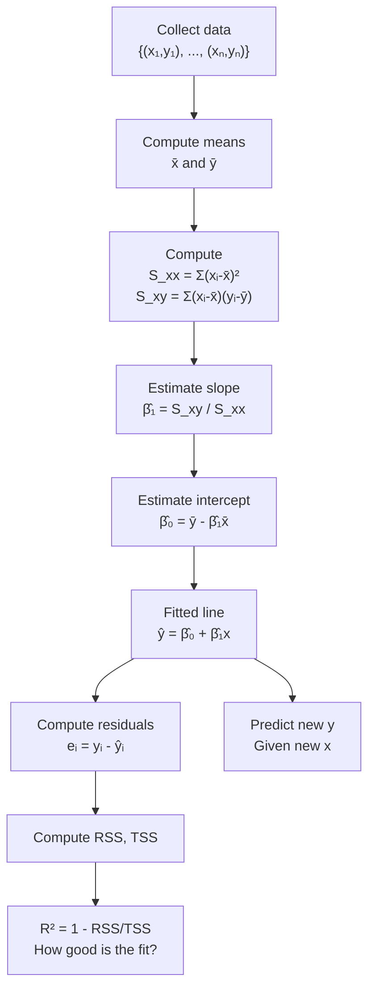
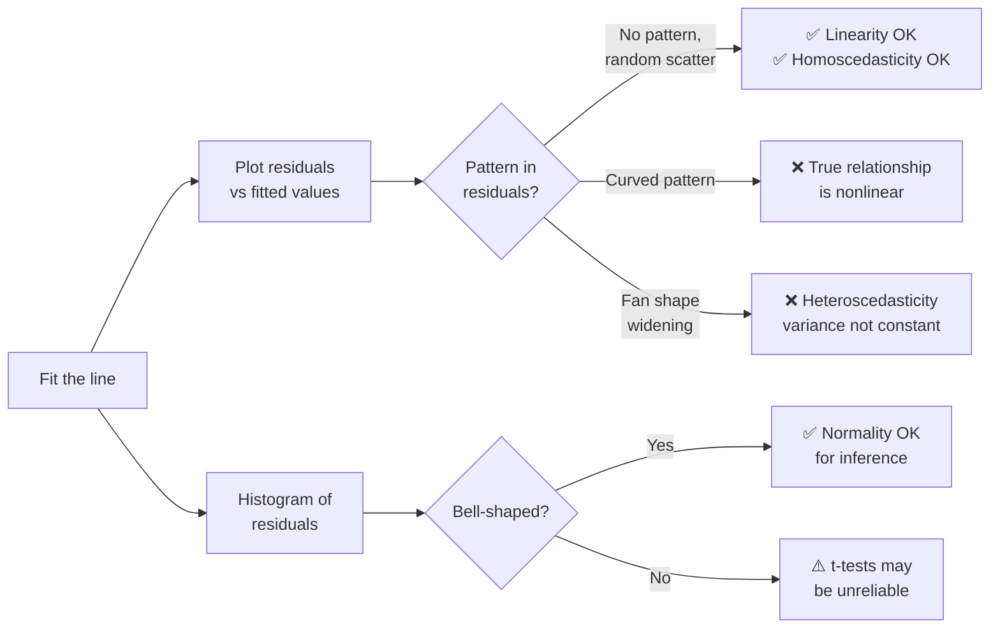
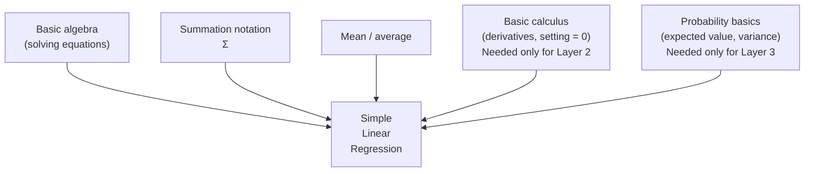
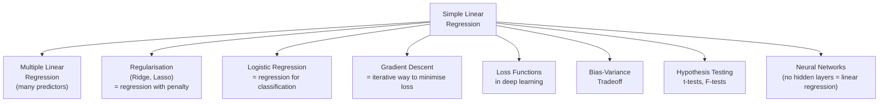

# Simple Linear Regression — Complete Notes

---

## 1. One-Line Summary

Simple Linear Regression finds the best straight line through a set of data points so you can predict one number from another — by making the prediction errors as small as possible.

---

## 2. Intuition First (before any math)

### The Real-World Analogy

Imagine you are trying to guess how many hours a student studied before an exam, and you want to predict their score. You collect data from 20 students:

| Hours Studied | Exam Score |
|---|---|
| 1 | 45 |
| 2 | 52 |
| 3 | 61 |
| 5 | 73 |
| 8 | 89 |
| ... | ... |

If you plot these on a piece of paper with "Hours" on the horizontal axis and "Score" on the vertical axis, the dots form a rough diagonal band going upward. You can clearly see: **more hours → higher score**.

Now someone asks: *"A student studied for 6 hours. What score do you predict?"*

You could eyeball it — but eyeballing is imprecise and different people would draw different lines. We want a **single, agreed-upon, mathematically optimal line** that every person using this data would arrive at. That is exactly what Simple Linear Regression gives you.

### What Problem Does It Solve?

It solves three things at once:

1. **Summarising a relationship** — "On average, every extra hour of study adds about 6 points."
2. **Making predictions** — Given a new input, produce a best-guess output.
3. **Measuring how strong the relationship is** — Is studying actually related to scores, or is it random noise?

### Why Does It Matter in ML/AI?

Simple linear regression is the **seed from which almost all of machine learning grew**. Understanding it deeply means understanding:

- What a **loss function** is (the thing you minimise to train any model)
- What **optimisation** means (finding the parameter values that make predictions best)
- What the **bias-variance tradeoff** is
- Why **neural networks** work the way they do — a neural network with no hidden layers and a straight output is literally linear regression

Every ML model you will ever study is, in some sense, a more complex version of linear regression. Master this first and everything else becomes an extension.

---

## 3. Formal Definition

The **Simple Linear Regression model** says:

$$y_i = \beta_0 + \beta_1 x_i + \varepsilon_i$$

Every symbol, defined right now:

- $i$ — an index for each data point. If you have 20 students, $i$ runs from 1 to 20.
- $y_i$ — the **response variable** (what you are trying to predict). Also called the output, target, or dependent variable. Example: exam score of student $i$.
- $x_i$ — the **predictor variable** (what you use to make the prediction). Also called the input, feature, or independent variable. Example: hours studied by student $i$.
- $\beta_0$ — the **intercept** (pronounced "beta-zero"). This is the value the line predicts when $x = 0$. It shifts the whole line up or down.
- $\beta_1$ — the **slope** (pronounced "beta-one"). This says: "for every 1 unit increase in $x$, the prediction increases by $\beta_1$ units."
- $\varepsilon_i$ — the **error term** (pronounced "epsilon-i"). This is the part of $y_i$ that $x_i$ alone cannot explain — random noise, unmeasured factors, etc.

**In plain English:** The model is saying — *"Each person's score ($y_i$) is approximately equal to a baseline ($\beta_0$) plus their study hours times some multiplier ($\beta_1 x_i$), with a little random noise added ($\varepsilon_i$)."*

We do not know the true $\beta_0$ and $\beta_1$. We **estimate** them from data. We call our estimates $\hat{\beta}_0$ and $\hat{\beta}_1$ (the hat symbol $\hat{}$ always means "estimated from data"). The estimated line is:

$$\hat{y}_i = \hat{\beta}_0 + \hat{\beta}_1 x_i$$

where $\hat{y}_i$ is our **predicted value** for observation $i$.

---

## ⬛ LAYER 1 — Core (Beginner Level)

### Step 1 — Plotting the Data

Let's use a tiny concrete dataset throughout this entire layer. Small enough to calculate by hand:

| Student $i$ | Hours $x_i$ | Score $y_i$ |
|---|---|---|
| 1 | 1 | 40 |
| 2 | 2 | 50 |
| 3 | 3 | 55 |
| 4 | 4 | 65 |
| 5 | 5 | 70 |

If you sketched this, you would see five dots forming an upward-sloping band. Clearly more hours relates to higher scores. We want to draw the **best straight line** through these five dots.

### Step 2 — What Does "Best Line" Even Mean?

There are infinitely many straight lines you could draw. How do you decide which one is best?

The natural answer is: **the line that makes the smallest prediction errors.**

Here is what a prediction error looks like. Suppose we guess the line is $\hat{y} = 30 + 8x$ (we're making this up for now). For Student 1 ($x = 1$):

$$\hat{y}_1 = 30 + 8 \times 1 = 38$$

But the actual score is $y_1 = 40$. The error is $40 - 38 = 2$.

We call this error a **residual**:

$$e_i = y_i - \hat{y}_i$$

The residual is how far the actual data point is from our line. Positive means the point is above the line; negative means it is below.

### Step 3 — Why We Square the Residuals

We have five residuals (one per student). We want a single number measuring how bad the line is overall. The obvious idea: add them up.

**Problem:** Positive and negative residuals cancel out. A line that is way too high for half the students and way too low for the other half could have residuals that sum to zero — but it is clearly a terrible line.

**Fix:** Square each residual before adding. Squaring makes everything positive, and it also punishes large errors more than small ones (a miss of 10 is four times worse than a miss of 5, because $10^2 = 100$ and $5^2 = 25$).

This sum is called the **Residual Sum of Squares (RSS)**:

$$\mathrm{RSS} = \sum_{i=1}^{n} (y_i - \hat{y}_i)^2 = \sum_{i=1}^{n} e_i^2$$

The symbol $\sum_{i=1}^{n}$ means "add up for every $i$ from 1 to $n$". Here $n = 5$.

**Our goal:** find the values of $\hat{\beta}_0$ and $\hat{\beta}_1$ that make RSS as small as possible.

This method is called **Ordinary Least Squares (OLS)** — "least squares" because we minimise the sum of squared residuals.

### Step 4 — The Formulas for the Best Line

After doing the calculus (which we will derive fully in Layer 2), the formulas for the best $\hat{\beta}_0$ and $\hat{\beta}_1$ turn out to be:

$$\hat{\beta}_1 = \frac{\sum_{i=1}^{n}(x_i - \bar{x})(y_i - \bar{y})}{\sum_{i=1}^{n}(x_i - \bar{x})^2}$$

$$\hat{\beta}_0 = \bar{y} - \hat{\beta}_1 \bar{x}$$

New symbols appearing here:

- $\bar{x}$ (pronounced "x-bar") — the **mean of all $x$ values**: $\bar{x} = \frac{1}{n}\sum_{i=1}^{n} x_i$
- $\bar{y}$ (pronounced "y-bar") — the **mean of all $y$ values**: $\bar{y} = \frac{1}{n}\sum_{i=1}^{n} y_i$

Let us compute everything with our five-student dataset.

**Step 4a — Compute the means:**

$$\bar{x} = \frac{1+2+3+4+5}{5} = \frac{15}{5} = 3$$

$$\bar{y} = \frac{40+50+55+65+70}{5} = \frac{280}{5} = 56$$

**Step 4b — Build a calculation table:**

For each student, compute $(x_i - \bar{x})$, $(y_i - \bar{y})$, their product, and $(x_i - \bar{x})^2$:

| $i$ | $x_i$ | $y_i$ | $x_i - \bar{x}$ | $y_i - \bar{y}$ | $(x_i-\bar{x})(y_i-\bar{y})$ | $(x_i-\bar{x})^2$ |
|---|---|---|---|---|---|---|
| 1 | 1 | 40 | $1-3=-2$ | $40-56=-16$ | $(-2)(-16)=32$ | $(-2)^2=4$ |
| 2 | 2 | 50 | $2-3=-1$ | $50-56=-6$ | $(-1)(-6)=6$ | $(-1)^2=1$ |
| 3 | 3 | 55 | $3-3=0$ | $55-56=-1$ | $(0)(-1)=0$ | $0^2=0$ |
| 4 | 4 | 65 | $4-3=1$ | $65-56=9$ | $(1)(9)=9$ | $1^2=1$ |
| 5 | 5 | 70 | $5-3=2$ | $70-56=14$ | $(2)(14)=28$ | $2^2=4$ |
| **Sum** | | | | | **75** | **10** |

**Step 4c — Compute the slope:**

$$\hat{\beta}_1 = \frac{75}{10} = 7.5$$

This means: **for every 1 extra hour studied, the predicted score goes up by 7.5 points.**

**Step 4d — Compute the intercept:**

$$\hat{\beta}_0 = \bar{y} - \hat{\beta}_1 \cdot \bar{x} = 56 - 7.5 \times 3 = 56 - 22.5 = 33.5$$

**Our fitted line is:** $\hat{y} = 33.5 + 7.5x$

**Step 4e — Make predictions and check residuals:**

| $i$ | $x_i$ | $y_i$ | $\hat{y}_i = 33.5 + 7.5x_i$ | $e_i = y_i - \hat{y}_i$ |
|---|---|---|---|---|
| 1 | 1 | 40 | 41.0 | $-1.0$ |
| 2 | 2 | 50 | 48.5 | $+1.5$ |
| 3 | 3 | 55 | 56.0 | $-1.0$ |
| 4 | 4 | 65 | 63.5 | $+1.5$ |
| 5 | 5 | 70 | 71.0 | $-1.0$ |

Notice: the errors are small (between $-1$ and $+1.5$) and they roughly balance out. No other straight line would produce a smaller RSS for this data.

### Step 5 — Measuring How Good the Fit Is: $R^2$

So we have a line. But is it a *good* line? What if the data were totally random — our line would have small-ish RSS too, just because we forced a line through it.

We need to compare our line's performance against a **baseline**: what if we had no $x$ information at all and just predicted $\bar{y}$ (the mean) for everyone?

We define:

- **Total Sum of Squares (TSS):** How much variation exists in $y$ if we just use the mean as our prediction. $\mathrm{TSS} = \sum_{i=1}^{n}(y_i - \bar{y})^2$
- **Residual Sum of Squares (RSS):** How much variation is left *after* our line. (Defined earlier.)

The **coefficient of determination**, written $R^2$, is:

$$R^2 = 1 - \frac{\mathrm{RSS}}{\mathrm{TSS}}$$

**Plain English:** $R^2$ is the fraction of the total variation in $y$ that our line *explains*. It always lives between 0 and 1 (for simple linear regression):

- $R^2 = 1$ → perfect fit, the line goes through every single point.
- $R^2 = 0$ → our line is no better than just predicting the mean.
- $R^2 = 0.85$ → our line explains 85% of the variation in $y$.

**Let us compute $R^2$ for our example:**

$\mathrm{RSS} = (-1)^2 + (1.5)^2 + (-1)^2 + (1.5)^2 + (-1)^2 = 1 + 2.25 + 1 + 2.25 + 1 = 7.5$

$\mathrm{TSS} = (-16)^2 + (-6)^2 + (-1)^2 + (9)^2 + (14)^2 = 256 + 36 + 1 + 81 + 196 = 570$

$$R^2 = 1 - \frac{7.5}{570} = 1 - 0.013 = 0.987$$

Our line explains **98.7%** of the variation in exam scores. That is an excellent fit (because we deliberately chose tidy data).

### Summary of Layer 1

You now know everything needed to actually *use* simple linear regression:

1. Compute $\bar{x}$ and $\bar{y}$ (the means).
2. Use the formulas to get $\hat{\beta}_1$ and $\hat{\beta}_0$.
3. Your fitted line is $\hat{y} = \hat{\beta}_0 + \hat{\beta}_1 x$.
4. Compute $R^2$ to see how well it fits.

---

## ⬛ LAYER 2 — Full Math Derivation (Intermediate)

> 📌 Before reading this layer, make sure you are comfortable with Layer 1. This layer uses basic **calculus** — specifically, taking derivatives. If that is new to you, here is a two-minute refresher:
>
> A **derivative** of a function tells you its slope at any point. If $f(x) = x^2$, the derivative is $f'(x) = 2x$. At $x = 3$, the slope is $2 \times 3 = 6$. When we minimise a function, we set its derivative to zero — because at a minimum, the slope is flat (zero). That is the only tool we need here.

### 2.1 — Setting Up the Optimisation Problem

We want to find $\beta_0$ and $\beta_1$ that minimise:

$$\mathrm{RSS}(\beta_0, \beta_1) = \sum_{i=1}^{n} (y_i - \beta_0 - \beta_1 x_i)^2 \tag{1}$$

We wrote it as $\mathrm{RSS}(\beta_0, \beta_1)$ to be explicit that RSS is a function of both unknowns — the data ($x_i$, $y_i$) is fixed; only $\beta_0$ and $\beta_1$ can vary.

**Geometric picture:** If you plotted RSS as a surface over a $(\beta_0, \beta_1)$ grid, it would look like a smooth bowl. We want the very bottom of that bowl.

```
RSS
│     ╲           ╱
│      ╲         ╱
│       ╲       ╱
│        ╲     ╱
│         ╲   ╱
│          ╲ ╱
│           ★  ← minimum (our answer)
└─────────────────── β₀, β₁ plane
```

### 2.2 — Deriving $\hat{\beta}_0$: The First Normal Equation

To minimise, we take the partial derivative with respect to $\beta_0$ and set it to zero.

**Partial derivative** means: treat $\beta_1$ as a constant and differentiate only with respect to $\beta_0$.

$$\frac{\partial \, \text{RSS}}{\partial \beta_0} = \sum_{i=1}^{n} 2(y_i - \beta_0 - \beta_1 x_i) \cdot (-1) = 0 \tag{2}$$

*Why $(-1)$ at the end?* By the chain rule: derivative of $(y_i - \beta_0 - \beta_1 x_i)^2$ is $2(\dots)$ times the derivative of the inside with respect to $\beta_0$, which is $-1$.

Divide both sides by $-2$:

$$\sum_{i=1}^{n} (y_i - \beta_0 - \beta_1 x_i) = 0 \tag{3}$$

Split the sum:

$$\sum_{i=1}^{n} y_i - n\beta_0 - \beta_1 \sum_{i=1}^{n} x_i = 0 \tag{4}$$

*Why $\sum \beta_0 = n\beta_0$?* Because $\beta_0$ is a constant — adding it $n$ times gives $n\beta_0$.

Divide through by $n$:

$$\bar{y} - \beta_0 - \beta_1 \bar{x} = 0 \tag{5}$$

Rearrange to solve for the intercept:

$$\hat{\beta}_0 = \bar{y} - \hat{\beta}_1 \bar{x} \tag{6}$$

**What this tells us geometrically:** The best-fit line always passes through the point $(\bar{x}, \bar{y})$ — the centre of mass of all the data. No matter what the data looks like, the OLS line is anchored to this centre.


---

### 2.3 — Deriving $\hat{\beta}_1$: The Second Normal Equation

Take the partial derivative with respect to $\beta_1$:

$$\frac{\partial \, \text{RSS}}{\partial \beta_1} = \sum_{i=1}^{n} 2(y_i - \beta_0 - \beta_1 x_i) \cdot (-x_i) = 0 \tag{7}$$

*Why $(-x_i)$?* Chain rule again — the derivative of the inside $(y_i - \beta_0 - \beta_1 x_i)$ with respect to $\beta_1$ is $-x_i$.

Divide by $-2$:

$$\sum_{i=1}^{n} x_i(y_i - \beta_0 - \beta_1 x_i) = 0 \tag{8}$$

Expand:

$$\sum_{i=1}^{n} x_i y_i - \beta_0 \sum_{i=1}^{n} x_i - \beta_1 \sum_{i=1}^{n} x_i^2 = 0 \tag{9}$$

Now substitute $\hat{\beta}_0 = \bar{y} - \hat{\beta}_1 \bar{x}$ from equation (6) — replacing $\beta_0$:

$$\sum_{i=1}^{n} x_i y_i - (\bar{y} - \hat{\beta}_1 \bar{x})\sum_{i=1}^{n} x_i - \hat{\beta}_1 \sum_{i=1}^{n} x_i^2 = 0 \tag{10}$$

Note that $\sum_{i=1}^{n} x_i = n\bar{x}$, so:

$$\sum_{i=1}^{n} x_i y_i - \bar{y}(n\bar{x}) + \hat{\beta}_1 \bar{x}(n\bar{x}) - \hat{\beta}_1 \sum_{i=1}^{n} x_i^2 = 0 \tag{11}$$

Collect the $\hat{\beta}_1$ terms on the right side:

$$\sum_{i=1}^{n} x_i y_i - n\bar{x}\bar{y} = \hat{\beta}_1\left(\sum_{i=1}^{n} x_i^2 - n\bar{x}^2\right) \tag{12}$$

Solve for $\hat{\beta}_1$:

$$\hat{\beta}_1 = \frac{\sum_{i=1}^{n} x_i y_i - n\bar{x}\bar{y}}{\sum_{i=1}^{n} x_i^2 - n\bar{x}^2} \tag{13}$$

### 2.4 — Simplifying to the Clean Form

The numerator and denominator of equation (13) have elegant alternative forms. Let us derive them.

**Claim:** $\displaystyle\sum_{i=1}^{n} x_i y_i - n\bar{x}\bar{y} = \sum_{i=1}^{n}(x_i - \bar{x})(y_i - \bar{y})$

**Proof:** Expand the right side:

$$\sum_{i=1}^{n}(x_i - \bar{x})(y_i - \bar{y}) = \sum_{i=1}^{n}\left(x_i y_i - x_i\bar{y} - \bar{x}y_i + \bar{x}\bar{y}\right)$$

$$= \sum x_i y_i - \bar{y}\underbrace{\sum x_i}_{n\bar{x}} - \bar{x}\underbrace{\sum y_i}_{n\bar{y}} + n\bar{x}\bar{y}$$

$$= \sum x_i y_i - n\bar{x}\bar{y} - n\bar{x}\bar{y} + n\bar{x}\bar{y} = \sum x_i y_i - n\bar{x}\bar{y} \quad \checkmark$$

This quantity is called $S_{xy}$ (the **sample covariance**, unnormalized).

**The same trick for the denominator** (replace $y_i$ with $x_i$ throughout):

$$\sum_{i=1}^{n} x_i^2 - n\bar{x}^2 = \sum_{i=1}^{n}(x_i - \bar{x})^2$$

This is called $S_{xx}$ (the **sample variance of $x$**, unnormalized).

So the final clean form is:

$$\boxed{\hat{\beta}_1 = \frac{S_{xy}}{S_{xx}} = \frac{\sum_{i=1}^{n}(x_i - \bar{x})(y_i - \bar{y})}{\sum_{i=1}^{n}(x_i - \bar{x})^2}} \tag{14}$$

### 2.5 — What the Slope Formula Is Actually Saying

Look at equation (14) carefully:

- The **numerator** $S_{xy}$: When $x$ is above its average, is $y$ also above its average? The product $(x_i - \bar{x})(y_i - \bar{y})$ is positive when both deviate in the same direction, negative when they deviate in opposite directions. Summing these products captures how $x$ and $y$ **move together**.

- The **denominator** $S_{xx}$: How spread out are the $x$ values? This normalises the numerator — you divide by how much $x$ varies on its own.

Together: the slope is **"how much $y$ moves with $x$, per unit of $x$'s own spread."**

### 2.6 — Verifying with Our Example

From Layer 1, we already computed: $S_{xy} = 75$, $S_{xx} = 10$.

$$\hat{\beta}_1 = \frac{75}{10} = 7.5 \quad \checkmark$$

$$\hat{\beta}_0 = 56 - 7.5 \times 3 = 33.5 \quad \checkmark$$

### 2.7 — The TSS = ESS + RSS Decomposition (Deriving $R^2$)

Define three quantities:

$$\mathrm{TSS} = \sum_{i=1}^{n}(y_i - \bar{y})^2 \quad \text{(total spread of } y \text{)} \tag{15}$$

$$\mathrm{ESS} = \sum_{i=1}^{n}(\hat{y}_i - \bar{y})^2 \quad \text{(spread explained by the line)} \tag{16}$$

$$\mathrm{RSS} = \sum_{i=1}^{n}(y_i - \hat{y}_i)^2 \quad \text{(spread left unexplained)} \tag{17}$$

**Theorem:** $\mathrm{TSS} = \mathrm{ESS} + \mathrm{RSS}$

**Proof:** Write $y_i - \bar{y} = (\hat{y}_i - \bar{y}) + (y_i - \hat{y}_i)$, then square both sides and sum:

$$\sum(y_i - \bar{y})^2 = \sum(\hat{y}_i - \bar{y})^2 + 2\sum(\hat{y}_i - \bar{y})(y_i - \hat{y}_i) + \sum(y_i - \hat{y}_i)^2$$

The cross-term $\sum(\hat{y}_i - \bar{y})(y_i - \hat{y}_i) = 0$.

*Why is the cross-term zero?* This follows directly from the normal equations we derived: they guarantee that residuals $(y_i - \hat{y}_i)$ are uncorrelated with fitted values $\hat{y}_i$. Think of it as: the line has "soaked up" all the linear information from $x$; what remains (residuals) has nothing left to correlate with.

Therefore: $\mathrm{TSS} = \mathrm{ESS} + \mathrm{RSS}$ ✓

And so:

$$R^2 = \frac{\mathrm{ESS}}{\mathrm{TSS}} = 1 - \frac{\mathrm{RSS}}{\mathrm{TSS}} \tag{18}$$

### 2.8 — $R^2$ Equals the Squared Correlation

In simple linear regression, there is a beautiful fact:

$$R^2 = r^2 \tag{19}$$

where $r$ is the **Pearson correlation coefficient**:

$$r = \frac{S_{xy}}{\sqrt{S_{xx} \cdot S_{yy}}} \tag{20}$$

and $S_{yy} = \sum_{i=1}^{n}(y_i - \bar{y})^2 = \mathrm{TSS}$.

**Why?** The slope is $\hat{\beta}_1 = S_{xy}/S_{xx}$. The ESS works out to $\hat{\beta}_1^2 \cdot S_{xx} = S_{xy}^2 / S_{xx}$. So:

$$R^2 = \frac{\mathrm{ESS}}{\mathrm{TSS}} = \frac{S_{xy}^2/S_{xx}}{S_{yy}} = \frac{S_{xy}^2}{S_{xx} \cdot S_{yy}} = r^2$$

This is unique to simple (one-variable) regression. In multiple regression, $R^2$ is no longer equal to the square of any single correlation.

---

## ⬛ LAYER 3 — Deep & Advanced

> ⚠️ This section is advanced. Come back after you are comfortable with Layers 1 and 2.
> You will need: basic probability, the idea of expected value, and some familiarity with linear algebra.

### 3.1 — The Statistical Model and Assumptions

Layers 1 and 2 treated regression as a pure **optimisation problem** — find the line that minimises RSS. But to make probabilistic statements ("is the slope significant?", "what is the confidence interval?"), we need a **statistical model** with assumptions.

The classical assumptions (called the **Gauss-Markov assumptions**) are:

1. **Linearity** — The true relationship is indeed $y_i = \beta_0 + \beta_1 x_i + \varepsilon_i$.
2. **Zero mean errors** — $\mathbb{E}[\varepsilon_i] = 0$. Errors average out to zero.
3. **Homoscedasticity** — $\mathrm{Var}(\varepsilon_i) = \sigma^2$ for all $i$. Every data point has the same error variance ($\sigma^2$ is unknown but constant).
4. **Independence** — $\varepsilon_i$ and $\varepsilon_j$ are independent for $i \neq j$.
5. **No measurement error in $x$** — We observe $x_i$ perfectly.

Additionally, for hypothesis tests and confidence intervals, we add:

6. **Normality** — $\varepsilon_i \sim \mathcal{N}(0, \sigma^2)$ (errors follow a Normal distribution).

### 3.2 — The Gauss-Markov Theorem (Why OLS Is Optimal)

**Theorem:** Under assumptions 1–4 above, the OLS estimators $\hat{\beta}_0$ and $\hat{\beta}_1$ are **BLUE** — the Best Linear Unbiased Estimators. "Best" means they have the smallest variance among all estimators that are linear in $y$ and unbiased.

**Unbiasedness proof for $\hat{\beta}_1$:**

Write $\hat{\beta}_1 = \sum w_i y_i$ where $w_i = \frac{x_i - \bar{x}}{S_{xx}}$ — it is a linear combination of the $y_i$'s.

Substitute $y_i = \beta_0 + \beta_1 x_i + \varepsilon_i$:

$$\mathbb{E}[\hat{\beta}_1] = \sum w_i \mathbb{E}[y_i] = \sum w_i(\beta_0 + \beta_1 x_i)$$

$$= \beta_0 \underbrace{\sum w_i}_{=0} + \beta_1 \underbrace{\sum w_i x_i}_{=1} = \beta_1 \quad \checkmark$$

(The two underbraced facts: $\sum w_i = \frac{\sum(x_i-\bar{x})}{S_{xx}} = 0$ and $\sum w_i x_i = \frac{S_{xx}}{S_{xx}} = 1$.)

**Variance of $\hat{\beta}_1$:**

Since the $y_i$'s are independent and each has variance $\sigma^2$:

$$\mathrm{Var}(\hat{\beta}_1) = \sum w_i^2 \cdot \sigma^2 = \frac{\sigma^2}{S_{xx}} \tag{21}$$

**Interpretation:** The more spread-out the $x$ values are (large $S_{xx}$), the smaller the variance of our slope estimate. If all $x$'s are the same, we cannot fit a slope at all — $S_{xx} = 0$ and the formula breaks.

### 3.3 — The Hessian and Why the OLS Solution Is a Minimum

> 📌 **What is a Hessian?** When you have a function of two variables (like $\mathrm{RSS}(\beta_0, \beta_1)$), the Hessian is a $2 \times 2$ table of all second derivatives. Just like a single second derivative tells you if a curve is concave up (a minimum) or concave down (a maximum), the Hessian tells you the same thing for a multi-variable surface. If the Hessian is "positive definite" (all eigenvalues positive), you are at a minimum.

The Hessian of $\mathrm{RSS}(\beta_0, \beta_1)$ is:

$$H = 2\begin{pmatrix} n & \sum x_i \\ \sum x_i & \sum x_i^2 \end{pmatrix}$$

The determinant is $4(n\sum x_i^2 - (\sum x_i)^2) = 4n^2 \cdot \mathrm{Var}(x)$, which is positive whenever $x$ has any variation. So our critical point is guaranteed to be a global minimum — not a maximum or saddle point.

This is also why RSS being a **convex function** (bowl-shaped) is important: convex functions have exactly one minimum.

### 3.4 — Estimating the Error Variance $\sigma^2$

The true error variance $\sigma^2$ is unknown. We estimate it from the residuals:

$$\hat{\sigma}^2 = \frac{\mathrm{RSS}}{n-2} \tag{22}$$

*Why divide by $n-2$ instead of $n$?* We estimated 2 parameters ($\hat{\beta}_0$ and $\hat{\beta}_1$) from the data. This "uses up" 2 degrees of freedom. The residuals are constrained — they must satisfy $\sum e_i = 0$ and $\sum x_i e_i = 0$ — so only $n-2$ of them are truly free. Dividing by $n-2$ makes $\hat{\sigma}^2$ an **unbiased estimator**: $\mathbb{E}[\hat{\sigma}^2] = \sigma^2$.

### 3.5 — Confidence Intervals and Hypothesis Tests

Under the normality assumption, the standardised estimates follow a $t$-distribution with $n-2$ degrees of freedom.

A **95% confidence interval** for $\beta_1$:

$$\hat{\beta}_1 \pm t_{n-2,\, 0.025} \cdot \mathrm{SE}(\hat{\beta}_1), \quad \text{where } \mathrm{SE}(\hat{\beta}_1) = \sqrt{\frac{\hat{\sigma}^2}{S_{xx}}} \tag{23}$$

The **hypothesis test** for whether $x$ is useful at all: $H_0: \beta_1 = 0$ (no relationship). The test statistic is:

$$t = \frac{\hat{\beta}_1}{\mathrm{SE}(\hat{\beta}_1)} \tag{24}$$

If $|t|$ is large (say, beyond $\pm 2$ for $n \geq 30$), we reject $H_0$ and conclude the relationship is statistically significant.

### 3.6 — Prediction Interval vs. Confidence Interval

There are two different intervals for a new $x_\text{new}$:

**Confidence interval for the mean** — how uncertain are we about the true average response at $x_\text{new}$?

$$\hat{y}_\text{new} \pm t_{n-2} \cdot \hat{\sigma}\sqrt{\frac{1}{n} + \frac{(x_\text{new} - \bar{x})^2}{S_{xx}}} \tag{25}$$

**Prediction interval for a new individual** — how uncertain are we about where one new actual data point will land?

$$\hat{y}_\text{new} \pm t_{n-2} \cdot \hat{\sigma}\sqrt{1 + \frac{1}{n} + \frac{(x_\text{new} - \bar{x})^2}{S_{xx}}} \tag{26}$$

The only difference is the $+1$ inside the square root. That $+1$ represents the **irreducible noise** of the new observation itself ($\varepsilon_\text{new}$). No matter how much data you collect, the prediction interval never shrinks to zero — there is always inherent randomness in a new individual outcome.

### 3.7 — What Breaks When Assumptions Are Violated

| Assumption Violated | What Breaks |
|---|---|
| Linearity | The line is the wrong shape; residual plots show curves |
| Zero mean ($\mathbb{E}[\varepsilon] \neq 0$) | $\hat{\beta}_0$ is biased |
| Heteroscedasticity (unequal variance) | OLS is no longer BLUE; standard errors are wrong |
| Correlated errors | Standard errors underestimated; tests give false positives |
| $x$ correlated with $\varepsilon$ (endogeneity) | $\hat{\beta}_1$ is biased AND inconsistent — the most serious violation |

### 3.8 — Connection to Maximum Likelihood Estimation

Under the normality assumption, OLS and **Maximum Likelihood Estimation (MLE)** give the same answer for $\hat{\beta}_0$ and $\hat{\beta}_1$.

Why? Under Normality, $y_i \sim \mathcal{N}(\beta_0 + \beta_1 x_i, \sigma^2)$. The likelihood function for all $n$ observations is:

$$L(\beta_0, \beta_1, \sigma^2) = \prod_{i=1}^{n} \frac{1}{\sqrt{2\pi\sigma^2}} \exp\!\left(-\frac{(y_i - \beta_0 - \beta_1 x_i)^2}{2\sigma^2}\right)$$

Maximising $L$ (or equivalently its log) with respect to $\beta_0, \beta_1$ is equivalent to minimising $\sum(y_i - \beta_0 - \beta_1 x_i)^2$ — which is exactly OLS. So **OLS = MLE when errors are Normal**. This is a deep connection: our least-squares choice is not arbitrary; it is the statistically optimal choice given Gaussian noise.

---

## 4. Code From Scratch (NumPy only)

```python
import numpy as np

# ═══════════════════════════════════════════════════════════
# SIMPLE LINEAR REGRESSION — FROM SCRATCH (NumPy only)
# Variable names match the math notation used in this document
# ═══════════════════════════════════════════════════════════

# ── DATA ────────────────────────────────────────────────────
# Using the same five-student dataset from Layer 1
# x = hours studied, y = exam score
x = np.array([1, 2, 3, 4, 5], dtype=float)  # predictor variable (xᵢ)
y = np.array([40, 50, 55, 65, 70], dtype=float)  # response variable (yᵢ)

n = len(x)  # number of observations — needed in several formulas

print("=" * 55)
print("RAW DATA")
print("=" * 55)
for i in range(n):
    print(f"  Student {i+1}: x={x[i]:.0f} hours, y={y[i]:.0f} points")

# ── STEP 1: COMPUTE MEANS ────────────────────────────────────
# x̄ = (1/n) Σ xᵢ   — the centre of all x values
# ȳ = (1/n) Σ yᵢ   — the centre of all y values
x_bar = np.mean(x)  # x̄
y_bar = np.mean(y)  # ȳ

print(f"\n{'='*55}")
print("STEP 1 — Sample Means")
print(f"{'='*55}")
print(f"  x̄  = {x_bar:.4f}")
print(f"  ȳ  = {y_bar:.4f}")

# ── STEP 2: COMPUTE Sxx AND Sxy ──────────────────────────────
# These are the building blocks of the slope formula (eq. 14)
# S_xx = Σ(xᵢ - x̄)²        — how spread out are the x values?
# S_xy = Σ(xᵢ - x̄)(yᵢ - ȳ) — do x and y move together?

x_dev = x - x_bar    # (xᵢ - x̄) for each i — deviation of x from mean
y_dev = y - y_bar    # (yᵢ - ȳ) for each i — deviation of y from mean

S_xx = np.sum(x_dev ** 2)          # denominator of β̂₁
S_xy = np.sum(x_dev * y_dev)       # numerator of β̂₁
S_yy = np.sum(y_dev ** 2)          # = TSS — needed for R²

print(f"\n{'='*55}")
print("STEP 2 — Intermediate Sums")
print(f"{'='*55}")
print(f"  Deviations (xᵢ - x̄):  {x_dev}")
print(f"  Deviations (yᵢ - ȳ):  {y_dev}")
print(f"  S_xx = Σ(xᵢ-x̄)²         = {S_xx:.4f}")
print(f"  S_xy = Σ(xᵢ-x̄)(yᵢ-ȳ)    = {S_xy:.4f}")
print(f"  S_yy = Σ(yᵢ-ȳ)² (= TSS)  = {S_yy:.4f}")

# ── STEP 3: COMPUTE β̂₁ AND β̂₀ ───────────────────────────────
# β̂₁ = S_xy / S_xx  (equation 14 in the notes)
# β̂₀ = ȳ - β̂₁ · x̄  (equation 6 in the notes)

beta_1_hat = S_xy / S_xx   # slope estimate
beta_0_hat = y_bar - beta_1_hat * x_bar  # intercept estimate

print(f"\n{'='*55}")
print("STEP 3 — OLS Coefficient Estimates")
print(f"{'='*55}")
print(f"  β̂₁ (slope)     = S_xy / S_xx = {S_xy} / {S_xx} = {beta_1_hat:.4f}")
print(f"  β̂₀ (intercept) = ȳ - β̂₁·x̄ = {y_bar} - {beta_1_hat:.4f}·{x_bar} = {beta_0_hat:.4f}")
print(f"\n  Fitted line: ŷ = {beta_0_hat:.2f} + {beta_1_hat:.2f}·x")

# ── STEP 4: COMPUTE FITTED VALUES AND RESIDUALS ───────────────
# ŷᵢ = β̂₀ + β̂₁·xᵢ  — what the line predicts for each point
# eᵢ = yᵢ - ŷᵢ      — residual: how far the actual point is from the line

y_hat = beta_0_hat + beta_1_hat * x   # fitted values (ŷᵢ)
e     = y - y_hat                      # residuals (eᵢ)

print(f"\n{'='*55}")
print("STEP 4 — Fitted Values and Residuals")
print(f"{'='*55}")
print(f"  {'i':>3} | {'xᵢ':>5} | {'yᵢ':>6} | {'ŷᵢ':>8} | {'eᵢ = yᵢ-ŷᵢ':>12}")
print(f"  {'-'*45}")
for i in range(n):
    print(f"  {i+1:>3} | {x[i]:>5.1f} | {y[i]:>6.1f} | {y_hat[i]:>8.2f} | {e[i]:>+12.2f}")

# Verify the two key properties of OLS residuals (from normal equations):
# 1) Σeᵢ = 0     (residuals sum to zero)
# 2) Σxᵢeᵢ = 0  (residuals are uncorrelated with x)
print(f"\n  Check: Σeᵢ   = {np.sum(e):.10f}  (should be ≈ 0)")
print(f"  Check: Σxᵢeᵢ = {np.sum(x*e):.10f}  (should be ≈ 0)")

# ── STEP 5: COMPUTE RSS, TSS, ESS, AND R² ────────────────────
# RSS = Σeᵢ²          — unexplained variation
# TSS = S_yy          — total variation in y (already computed above)
# ESS = TSS - RSS     — variation explained by the line
# R²  = 1 - RSS/TSS  — fraction of variation explained

RSS = np.sum(e ** 2)                    # Residual Sum of Squares
TSS = S_yy                              # Total Sum of Squares (= Σ(yᵢ-ȳ)²)
ESS = np.sum((y_hat - y_bar) ** 2)     # Explained Sum of Squares

R_squared = 1 - RSS / TSS              # coefficient of determination

print(f"\n{'='*55}")
print("STEP 5 — Variance Decomposition and R²")
print(f"{'='*55}")
print(f"  RSS = Σeᵢ²           = {RSS:.4f}")
print(f"  TSS = Σ(yᵢ-ȳ)²      = {TSS:.4f}")
print(f"  ESS = Σ(ŷᵢ-ȳ)²      = {ESS:.4f}")
print(f"  ESS + RSS            = {ESS + RSS:.4f}  (should equal TSS = {TSS:.4f})")
print(f"\n  R² = 1 - RSS/TSS = 1 - {RSS:.2f}/{TSS:.2f} = {R_squared:.6f}")
print(f"  → The line explains {R_squared*100:.1f}% of the variance in y")

# ── STEP 6: VERIFY R² = r² ───────────────────────────────────
# Pearson correlation: r = S_xy / sqrt(S_xx · S_yy)
# In simple regression R² must equal r²  (equation 19 in the notes)

r = S_xy / np.sqrt(S_xx * S_yy)  # Pearson correlation coefficient

print(f"\n{'='*55}")
print("STEP 6 — Correlation Check (R² = r²)")
print(f"{'='*55}")
print(f"  r       = S_xy / √(S_xx·S_yy) = {r:.6f}")
print(f"  r²      = {r**2:.6f}")
print(f"  R²      = {R_squared:.6f}   (should equal r²)")

# ── STEP 7: MAKE A PREDICTION ────────────────────────────────
# Given a new x, predict y using the fitted line

x_new = 6.0  # new student studied 6 hours
y_pred = beta_0_hat + beta_1_hat * x_new  # predicted score

print(f"\n{'='*55}")
print("STEP 7 — Prediction")
print(f"{'='*55}")
print(f"  New input: x_new = {x_new} hours")
print(f"  Prediction: ŷ = {beta_0_hat:.2f} + {beta_1_hat:.2f} × {x_new} = {y_pred:.2f} points")

# ── LAYER 3: ERROR VARIANCE ESTIMATE ─────────────────────────
# σ̂² = RSS / (n-2)  — unbiased estimate of true error variance
# We divide by n-2 (not n) because 2 parameters were estimated

sigma_sq_hat = RSS / (n - 2)        # estimated error variance σ̂²
sigma_hat    = np.sqrt(sigma_sq_hat) # estimated error std deviation σ̂

SE_beta_1 = np.sqrt(sigma_sq_hat / S_xx)  # standard error of β̂₁  (eq. 23)

print(f"\n{'='*55}")
print("LAYER 3 — Standard Error and Uncertainty")
print(f"{'='*55}")
print(f"  σ̂²          = RSS/(n-2) = {RSS:.4f}/{n-2} = {sigma_sq_hat:.4f}")
print(f"  σ̂           = {sigma_hat:.4f}")
print(f"  SE(β̂₁)      = σ̂/√S_xx  = {sigma_hat:.4f}/√{S_xx:.1f} = {SE_beta_1:.4f}")
print(f"  t-statistic = β̂₁ / SE(β̂₁) = {beta_1_hat:.4f} / {SE_beta_1:.4f} = {beta_1_hat/SE_beta_1:.4f}")
```

---

## 5. Visual Explanation

### 5.1 — What the Line Is Doing

```
Score (y)
  70 |                               ●  (actual)
     |                            ╱  ○  (predicted by line)
  65 |                         ●╱
     |                      ╱  ○
  60 |                   ╱
     |             ●  ╱  ○         ← residual = vertical gap
  55 |          ╱
     |       ●╱
  50 |    ╱  ○
     | ●╱
  45 |╱  ○
  40 |
     └────────────────────────────── Hours (x)
        1    2    3    4    5

  ● = actual data point
  ○ = predicted value (on the line)
  The vertical gap between ● and ○ is the residual eᵢ
```

Each vertical gap is a residual. OLS makes the **sum of squared gaps as small as possible.**

### 5.2 — The Key Geometric Fact

```
  y
  │         ● ●                The OLS line always passes through (x̄, ȳ)
  │       ●    ←── (x̄, ȳ)     No matter what the data looks like.
  │     ●  ✦ ────────────────  This is guaranteed by equation (6):
  │   ●    ╱                   β̂₀ = ȳ - β̂₁ · x̄
  │       ╱
  └──────────────────── x
```

The star ✦ marks $(\bar{x}, \bar{y})$. Every OLS line passes through this point — it pivots around the data's centre.

### 5.3 — The Variance Decomposition

```
  For one data point:

  yᵢ  ●
      |  ← eᵢ = yᵢ - ŷᵢ    (residual — what the line missed)
  ŷᵢ  ○
      |  ← (ŷᵢ - ȳ)         (what the line explained)
  ȳ   ──────────────────
      ↑
  Total gap = (yᵢ - ȳ) = explained + unexplained

  TSS = ESS + RSS
  (Total = Explained + Residual)
```

### 5.4 — Full Process Flow



### 5.5 — Assumptions Check (What to Plot After Fitting)



---

## 6. Interview Preparation

### 5 Conceptual Questions

---

**Q1: Explain simple linear regression to someone who has never heard of it.**

**Ideal answer:** Simple linear regression is a method for finding the best straight line to describe the relationship between two numerical variables. You have an input variable $x$ and an output variable $y$, and you want to predict $y$ from $x$.

"Best" is defined precisely: we minimise the sum of squared vertical distances from each data point to the line. This is called Ordinary Least Squares (OLS). The result is two numbers — a slope $\hat{\beta}_1$ and an intercept $\hat{\beta}_0$ — that define the line $\hat{y} = \hat{\beta}_0 + \hat{\beta}_1 x$.

The slope tells you: "for every 1-unit increase in $x$, the prediction increases by $\hat{\beta}_1$." The intercept is the prediction when $x = 0$. We measure fit using $R^2$, which is the fraction of variation in $y$ explained by the line.

---

**Q2: Derive the OLS estimator for the slope from scratch.**

**Ideal answer:** We minimise $\mathrm{RSS} = \sum_{i=1}^n (y_i - \beta_0 - \beta_1 x_i)^2$.

Take $\frac{\partial \mathrm{RSS}}{\partial \beta_0} = 0$ → this gives $\hat{\beta}_0 = \bar{y} - \hat{\beta}_1 \bar{x}$ (the line passes through $(\bar{x}, \bar{y})$).

Take $\frac{\partial \mathrm{RSS}}{\partial \beta_1} = 0$ and substitute $\hat{\beta}_0$ → after simplification:

$$\hat{\beta}_1 = \frac{\sum(x_i - \bar{x})(y_i - \bar{y})}{\sum(x_i - \bar{x})^2} = \frac{S_{xy}}{S_{xx}}$$

The numerator is the covariance of $x$ and $y$; the denominator is the variance of $x$. The slope is how much $y$ co-moves with $x$, normalised by how much $x$ varies on its own.

---

**Q3: What does $R^2$ measure, and what are its limitations?**

**Ideal answer:** $R^2 = 1 - \mathrm{RSS}/\mathrm{TSS}$ measures the fraction of total variance in $y$ explained by the linear model. It ranges from 0 (model no better than predicting the mean) to 1 (perfect fit).

Limitations:
- **High $R^2$ does not mean the model is correct.** You can get $R^2 = 0.99$ with a badly misspecified model if the signal is strong.
- **$R^2$ cannot decrease when you add variables.** In multiple regression, $R^2$ always goes up when you add a predictor — even a random one. That is why adjusted $R^2$ exists.
- **It says nothing about causation.** $R^2 = 0.95$ does not mean $x$ causes $y$.
- **It does not tell you whether predictions are useful** in an absolute sense — a model explaining 70% of variance in stock prices might still be useless for trading.

---

**Q4: What assumptions does OLS make, and what happens when they break?**

**Ideal answer:** The Gauss-Markov assumptions are: linearity, zero-mean errors, homoscedasticity (constant error variance), and independent errors.

If **linearity** breaks: the line is the wrong shape, residuals show a curved pattern. Solution: transform variables or use polynomial regression.

If **homoscedasticity** breaks: standard errors are wrong, so confidence intervals and hypothesis tests are unreliable. OLS is no longer the most efficient estimator. Solution: use heteroscedasticity-robust standard errors or Weighted Least Squares.

If **errors are correlated** (common in time series): standard errors are underestimated, giving false confidence. Solution: use methods that model the error structure (e.g. ARIMA, GLS).

If **$x$ is correlated with $\varepsilon$** (endogeneity): $\hat{\beta}_1$ is biased even in large samples. This is the most serious violation. Solution: Instrumental Variables regression.

---

**Q5: Why do we square the residuals instead of taking absolute values?**

**Ideal answer:** Three reasons:

First, squaring makes everything positive — positive and negative errors do not cancel.

Second, squaring penalises large errors more heavily than small ones. A squared error of 100 (a miss of 10) is four times worse than 25 (a miss of 5). This is usually the right behaviour — being way off is disproportionately bad.

Third, and most importantly: the square function is **differentiable everywhere**, including at zero. The absolute value function $|e|$ has a kink at zero — it is not differentiable there — making calculus-based optimisation messy. The squared loss has a clean, smooth gradient everywhere, which is why gradient descent works so well on it. This also extends to neural networks: squaring is the natural loss for regression in deep learning for the exact same reason.

---

### 3 Trap Questions

---

**Trap Q1: "If I swap $x$ and $y$ — regress $y$ on $x$ — and then regress $x$ on $y$ — and invert that line — do I get the same line?"**

**Intuition says:** "Yes — it's the same relationship, just described both ways."

**The surprising truth:** NO. They give different lines.

Regressing $y$ on $x$ minimises **vertical** residuals. Regressing $x$ on $y$ minimises **horizontal** residuals. These are different geometric objects. The two lines coincide only when $r = \pm 1$ (perfect correlation). In general:

- Slope of $y$-on-$x$: $r \cdot \frac{s_y}{s_x}$
- Slope of $x$-on-$y$ (expressed as rise over run in the $y$ direction): $\frac{1}{r} \cdot \frac{s_y}{s_x}$

Since $|r| \leq 1$, the second is always steeper. This is not a symmetry: OLS is inherently asymmetric. If you want a line that minimises perpendicular distances, you need Orthogonal Regression (Total Least Squares).

---

**Trap Q2: "Adding a new predictor to a regression model always improves the model, right? $R^2$ went up."**

**Intuition says:** "More information is always better."

**The surprising truth:** $R^2$ can only stay the same or increase when you add a variable — even a completely random, meaningless one. This is a mathematical fact, not a sign of improvement. Adding random noise predictors will inflate $R^2$ while making the model worse at predicting new data.

The distinction is between **in-sample fit** (how well the line fits the data it was trained on) and **out-of-sample prediction** (how well it predicts new data). Adding variables always helps the former and can hurt the latter. This is called **overfitting**. The solution is adjusted $R^2$, cross-validation, or information criteria like AIC.

---

**Trap Q3: "A student scored 95/100. They probably studied a lot and will score just as high next time, right?"**

**Intuition says:** "Yes, high performers consistently perform high."

**The surprising truth:** This is the **regression to the mean** phenomenon. Extreme scores contain a component of luck. The student who scored 95 probably had both good skill *and* a good luck day (easy questions, feeling great, etc.). On the next test, the luck component is independent — so statistically, their score is expected to be closer to the population mean than 95.

This is where the term "regression" originally came from. Galton (1886) found that children of very tall parents were on average tall, but not as tall as their parents — they "regressed to the mean." Linear regression gets its name from this observation.

---

### Common Mistakes Candidates Make

1. **Confusing $\varepsilon_i$ (true error) with $e_i$ (residual).** $\varepsilon_i$ is the unobservable true noise in the data-generating process. $e_i$ is what we compute from our fitted line. They are different — residuals have constraints ($\sum e_i = 0$, $\sum x_i e_i = 0$); true errors do not.

2. **Claiming "high $R^2$ means the model is correct."** $R^2$ only measures linear fit. The relationship could be nonlinear and $R^2$ could still be high. Always plot residuals.

3. **Forgetting to define $\bar{x}$ and $\bar{y}$ in a whiteboard derivation.** Interviewers notice when symbols appear without definition.

4. **Confusing prediction intervals and confidence intervals.** The CI is for the *average* response; the PI is for an *individual* new observation. PI is always wider because it includes the irreducible noise $\varepsilon_\text{new}$.

5. **Treating regression as causal.** OLS gives the best linear predictor. Whether $x$ *causes* $y$ requires additional assumptions or experimental design. Do not say "a one-unit increase in $x$ *causes* a $\hat{\beta}_1$ increase in $y$" — say "is *associated with*."

---

## 7. Connections Map

### What You Need Before This



### What This Unlocks



### Where This Appears in Real ML/AI Systems

- **Linear probing of pretrained models (BERT, ResNets):** Freeze the model, then train a linear regression/classifier on top of the embeddings. This tells you how much task-relevant information is linearly separable in the representations.
- **Reward modelling in RLHF:** The reward model can be understood as a regression problem — predicting human preference scores from text embeddings.
- **Feature importance:** Linear regression coefficients are the simplest measure of feature importance in any model.
- **Calibration of classifier outputs:** Platt scaling (fitting a logistic regression to a classifier's raw outputs) is a direct extension of linear regression.
- **Interpretability:** LIME (Local Interpretable Model-agnostic Explanations) fits a local linear regression around each prediction to explain what the model is doing.

---

## 8. Quick Reference Cheat Sheet

```
╔══════════════════════════════════════════════════════════════╗
║            SIMPLE LINEAR REGRESSION — CHEAT SHEET           ║
╠══════════════════════════════════════════════════════════════╣
║  THE MODEL                                                   ║
║  yᵢ = β₀ + β₁xᵢ + εᵢ                                       ║
║  ŷᵢ = β̂₀ + β̂₁xᵢ    (fitted line, no noise term)           ║
║                                                              ║
║  KEY NOTATION                                                ║
║  x̄, ȳ   = sample means of x and y                         ║
║  S_xx    = Σ(xᵢ-x̄)²          (variance of x, unnorm.)     ║
║  S_xy    = Σ(xᵢ-x̄)(yᵢ-ȳ)    (covariance of x,y, unnorm.) ║
║  S_yy    = Σ(yᵢ-ȳ)² = TSS   (variance of y, unnorm.)      ║
║  eᵢ      = yᵢ - ŷᵢ           (residual for point i)        ║
║                                                              ║
║  OLS FORMULAS                                                ║
║  β̂₁ = S_xy / S_xx    (slope)                               ║
║  β̂₀ = ȳ - β̂₁·x̄    (intercept; line passes thru (x̄,ȳ))  ║
║                                                              ║
║  GOODNESS OF FIT                                             ║
║  RSS = Σeᵢ²                 (unexplained variation)         ║
║  TSS = Σ(yᵢ-ȳ)²            (total variation in y)         ║
║  R²  = 1 - RSS/TSS          (fraction explained; 0 to 1)   ║
║  R²  = r²  in simple regression  (r = Pearson correlation) ║
║                                                              ║
║  ERROR VARIANCE (Layer 3)                                    ║
║  σ̂² = RSS/(n-2)  — divide by n-2, NOT n                    ║
║                                                              ║
║  KEY PROPERTIES                                              ║
║  • Σeᵢ = 0   and   Σxᵢeᵢ = 0  (always, by construction)   ║
║  • OLS line always passes through (x̄, ȳ)                   ║
║  • OLS is BLUE under Gauss-Markov assumptions               ║
║  • R² ∈ [0,1] for simple regression (can be < 0 otherwise) ║
║  • Higher spread in x → lower variance in β̂₁ estimate      ║
║                                                              ║
║  3 THINGS THAT WILL COME UP IN AN INTERVIEW                 ║
║  1. Derive β̂₁ from scratch (∂RSS/∂β₁ = 0, show algebra)   ║
║  2. Regress y-on-x vs x-on-y: NOT the same line (why?)     ║
║  3. R² always increases when adding variables — dangerous   ║
╚══════════════════════════════════════════════════════════════╝
```
